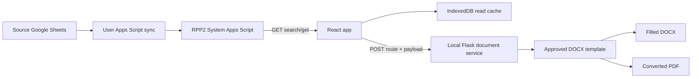

# ANF3 Laboratory Records

ANF3 is a controlled, read-only laboratory-record workspace for Water, Air,
and Cleaning Validation (CV). The browser reads normalized records from the
owner-managed Google Sheets / Apps Script system, lets an operator review them,
and asks the local document service to create a Word/PDF report from an
approved DOCX template.


This README is the implementation handoff. It describes the active execution
path, the seven document workflows, the contracts that must not drift, and the
commands a new coding agent should run before changing anything.

## Read this first

- `AGENTS.md` is the repository policy and source-of-truth order.
- `HANDOFF.md` records the v7.1 architecture and the design decisions behind
  the current React workspace.
- `docs/GOAL.md` is the release definition of done.
- `docs/CABINET_WORKFLOW_MATRIX.md` is the source of truth for buildings,
  binders, and logical workflow routes.
- `docs/CV_TEMPLATE_ROUTING_CONTRACT.md` is the source of truth for CV method
  routing.
- `OWNER_MANUAL.md` and `OWNER_SETUP_TH.md` describe Apps Script setup and
  deployment. They are owner-facing, not substitutes for repository tests.

The current active application is the React/Vite application under
`apps/web/`. The root HTML workflows (`pw-prw/`, `wfi-pus/`, `em-air/`,
`compressed-air/`, `cv/`, and related root pages) are legacy fallbacks kept for
compatibility and validation. Do not redesign or refactor those pages while
working on the active application unless the task explicitly targets them.

## Non-negotiable boundaries

1. The browser is read-only. It never creates, edits, deletes, numbers, or
   synchronizes a laboratory record.
2. Google Sheets and Apps Script own record creation, worksheet numbering,
   sync status, and production data.
3. The DOCX files in `templates/` are controlled layout artifacts. Inspect the
   real DOCX XML before changing a mapping; do not recreate a form in HTML.
4. Missing data stays blank. Never invent a result, tag, lot, equipment ID,
   date, approval, or replicate value.
5. Use only the logical building groups `B10`, `B12`, `B16`, and `OT`. Building
   11 and Building 19 are displayed as `Other` and must not create new shards.
6. Worksheet numbers are the external document identity. A content hash is an
   internal cache identity only and must not replace the worksheet filename.
7. A production Apps Script deployment, Sheet mutation, permission change, or
   live document mutation requires explicit owner action. Local read-only
   smoke checks are allowed.

## End-to-end architecture



### Runtime sequence

1. An owner or operator works in a source Sheet. A bound User Apps Script
   groups rows, preserves existing identities, allocates a worksheet number
   when needed, and sends a create-only payload to the matching RPP2 System
   Web App.
2. The System Apps Script validates the payload, routes it to the correct
   physical shard, stores `samplesJson`, and exposes read-only `search` and
   `get` actions through its `/exec` Web App.
3. `apps/web/src/api.ts` calls the logical domain endpoint. It sends
   `workflow`, search filters, and an opaque cursor; it does not send a sheet
   name. Water/Air record keys are normally worksheet numbers. CV search keys
   are record IDs, while CV `get` also accepts a worksheet number.
4. The React app stores successful record/search reads in IndexedDB for the
   offline read-cache path. Cache data is not a write queue for the System DB.
5. `apps/web/src/recordPolicy.ts` selects the PDF route. The three CV routes
   are separate even when a CV Rinse route reuses a Water template family.
6. `apps/web/src/documentPayload.ts` converts the record and samples into the
   exact placeholder keys used by the selected template. It also splits
   over-capacity records into self-contained page dictionaries.
7. `apps/web/src/batchPrint.ts` posts the route, worksheet number, payload,
   optional pages, and CV context to `POST /api/pdfs` on the local Flask
   service. The browser can edit only the allowlisted local print draft; it
   cannot edit the source record.
8. `server/pdf_server.py` owns template resolution, CV route validation,
   placeholder replacement, unresolved-placeholder checks, DOCX-to-PDF
   conversion, caching, and controlled conflict handling.

### Endpoint configuration

- Release installations read `config.json` beside `dist/index.html`. An owner
  can paste a public read-only Apps Script `/exec` URL into
  `waterReadUrl`, `airReadUrl`, or `cvReadUrl` and refresh without rebuilding.
- Developer builds can use `.env.production` with
  `VITE_WATER_READ_URL`, `VITE_AIR_READ_URL`, and `VITE_CV_READ_URL`.
- `vite.config.ts` sets `envDir: '../../'` because the Vite root is
  `apps/web/` while `.env.production` is at the repository root.
- Never put `ANF3_SYNC_TOKEN`, mutation credentials, or private production
  data in `config.json`, `.env.production`, browser code, or `dist/`.
- The fetch client deliberately uses `credentials: 'omit'`. The deployed
  read Web Apps are public read endpoints and should not receive browser
  cookies.

## Seven workflow handoff cards

The table is a quick index. The sections that follow are the implementation
instructions for each workflow.

| Workflow | UI ID / API domain | System shards | Template route | Capacity | Worksheet identity |
| --- | --- | --- | --- | ---: | --- |
| Water PW/PRW | `pw-prw` / `water` | `records_pw_prw_B10/B12/B16/OT` | `pw-prw-template.docx` | 30 | `WT-YY-B10/B12/B16/OT-####` |
| Water WFI/PUS | `wfi-pus` / `water` | `records_wfi_B16/OT` plus legacy `records_wfi` reads | `wfi-pus-template.docx` | 30 | `WP-YY-B16/OT-####` |
| Environmental Monitoring | `em-air` / `air` | `records_em_B10/B12/B16/OT` | `em-template.docx` | 50 | `AT-YY-B10/B12/B16/OT-####` |
| Compressed Air | `compressed-air` / `air` | `records_ca_B10/B12/B16/OT` | `ca-template.docx` | 10 | `AC-YY-B10/B12/B16/OT-####` |
| CV Contact Plate | UI `cv`; PDF `cleaning-validation-contact` / `cv` | `records_cv_contact_B10/B12/B16/OT` | `cv-contact-template.docx` | 10 | `CV-YY-B10/B12/B16/OT-####` |
| CV Rinse Pour Plate | UI `cv`; PDF `cleaning-validation-rinse-pour` / `cv` | `record_cv_rinse_B10/B12/B16/OT` | `pw-prw-template.docx` | 30 | `CVR-YY-B10/B12/B16/OT-####` |
| CV Rinse Membrane Filtration | UI `cv`; PDF `cleaning-validation-rinse-membrane` / `cv` | `record_cv_rinse_B10/B12/B16/OT` | `wfi-pus-template.docx` | 30 | `CVR-YY-B10/B12/B16/OT-####` |

`YY` is the Bangkok-year two-digit value. CV Pour Plate and CV Membrane
Filtration intentionally share the CVR sequence per building. The singular
`record_cv_rinse_*` sheet name is part of the compatibility contract.

### 1. Water PW/PRW

**Route identity**

- React workflow: `pw-prw`; domain endpoint: Water; query parameter:
  `workflow=pw-prw`.
- User sync: `google/app-scripts/water-r.gs`, source type `pw-prw`, source
  tab `prw-pw`.
- System code: `google/app-scripts/RPP2-water-record.gs`.
- PDF route: `pw-prw`; controlled template:
  `templates/pw-prw-template.docx`.

**Record flow**

1. The User script groups source rows and keeps an existing worksheet number
   for recovery. New records are routed by building to
   `records_pw_prw_B10`, `_B12`, `_B16`, or `_OT`.
2. Building 10, 12, and 16 retain their segment. Any other or blank building,
   including legacy Building 11/19 display cases, maps to `OT`.
3. New numbers use the `WT-YY-SEGMENT-####` family. Historical numbers are
   read as-is and must not be renumbered.
4. The System API returns summary rows from `search` and the full record plus
   `samples` from `get`. `recordKey` is the worksheet number.

**Sample contract**

Each sample may contain `samplingPoint`, `samplingTag`, `location`,
`noLocation`, `waterType`, `result1`, `result2`, and `resultAvg`. The document
mapper emits `result01` through `result30`, preserving the three PW/PRW result
columns. A source path that has only one final result must not fabricate
replicate I/II values.

**Where to change it**

- Building/filter behavior: `apps/web/src/appData.ts` and the Water System
  matcher in `RPP2-water-record.gs`.
- Source grouping/number allocation: `water-r.gs`.
- Placeholder mapping/pagination: `apps/web/src/documentPayload.ts`.
- Template allowlist/registry: `server/pdf_server.py` and the template XML.

**Minimum regression**

Test B10, B12, B16, and Other isolation, a multi-sample record, a blank result,
and an existing legacy worksheet number. Confirm that the PW/PRW template is
selected and that no `result1NN`/`result2NN` value is invented.

### 2. Water WFI/PUS

**Route identity**

- React workflow: `wfi-pus`; domain endpoint: Water; query parameter:
  `workflow=wfi-pus`.
- User sync: `google/app-scripts/water-r.gs`, source type `wfi-pus`, source
  tab `wfi-pus`.
- System code: `google/app-scripts/RPP2-water-record.gs`.
- PDF route: `wfi-pus`; controlled template:
  `templates/wfi-pus-template.docx`.

**Record flow**

1. Active WFI/PUS records use `records_wfi_B16` for Building 16 and
   `records_wfi_OT` for every other/blank building. The unsuffixed
   `records_wfi` tab is a historical read source; do not treat it as a new
   write target without explicit evidence.
2. New numbers use `WP-YY-B16-####` or `WP-YY-OT-####`. Do not add B10/B12
   WFI binders or shards just because the generic building list contains them.
3. The frontend filters the workflow mainly through `waterType=WFI/PUS` and
   receives `samples` through the same Water `search/get` envelope.

**Sample and alias contract**

WFI/PUS uses the single sample field `result`, not `resultAvg`. The mapper
emits `result01` through `result30`. Preserve these known aliases:

- source/RPP2 `lotPMembrane` -> template `lotMembrane`;
- source/RPP2 `leftEM` and `rightEM` -> template `leftEm` and `rightEm`;
- exact placeholder spelling, case, and whitespace from the WFI DOCX.

**Where to change it**

Use `water-r.gs` for source sync, `RPP2-water-record.gs` for System API/shard
behavior, `apps/web/src/documentPayload.ts` for React mapping, and
`templates/wfi-pus-template.docx` plus `server/pdf_server.py` for document
behavior. Do not copy the PW/PRW three-result contract into WFI/PUS.

**Minimum regression**

Test B16 and Other filters, one historical `records_wfi` record, a blank result,
and an over-30 sample fixture. Verify the generated document uses `resultNN`
and does not contain unresolved `lotPMembrane`, `leftEM`, or `rightEM` aliases.

### 3. Environmental Monitoring Air

**Route identity**

- React workflow: `em-air`; domain endpoint: Air; query parameter:
  `workflow=em-air`.
- User sync: `google/app-scripts/air-test.gs`, source type `em`, source tab
  `records-Air`, number prefix `AT`.
- System code: `google/app-scripts/RPP2-air-record.gs`.
- PDF route: `em-air`; controlled template: `templates/em-template.docx`.

**Record flow**

1. New records route to `records_em_B10`, `_B12`, `_B16`, or `_OT`. The
   User script preserves an existing worksheet number before allocating a new
   one.
2. New numbers use `AT-YY-SEGMENT-####`.
3. The UI can filter by `samplingMode=passive,active`. The API filter is
   sample-aware; do not implement it as a client-only post-filter.
4. The source sync carries room, grade, temperature, humidity, entry/exit
   times, and remarks. `occurResult` is owned by the RPP2/lab result stage and
   starts blank when the source does not provide it.

**Sample contract**

Samples use `roomNo`/`samplingPoint`, `location`, `floor`, `grade`, `tempRoom`,
`rhRoom`, `timeIn`, `timeOut`, `occurResult`, and `remark`. The DOCX mapper
emits `roomNo01` through `roomNo50`, `gradeNN`, `tempRoomNN`, `rhRoomNN`,
`timeInNN`, `timeOutNN`, `occurResultNN`, and `remarkNN`. `floor` is taken from
the record when present, otherwise from the first sample because the source
stores it at sample level.

**Where to change it**

Use `air-test.gs` for source grouping and `database_em` for master sampling
data. Use the Air search/get functions in `RPP2-air-record.gs`, then update
`documentPayload.ts` and the real `em-template.docx` mapping together.

**Minimum regression**

Test passive and active filters, all four logical building segments, a record
with more than 50 samples split into pages, blank temperature/humidity, and a
non-numeric result such as `TNTC`. Confirm that missing fields remain blank.

### 4. Compressed Air

**Route identity**

- React workflow: `compressed-air`; domain endpoint: Air; query parameter:
  `workflow=compressed-air`.
- User sync: `google/app-scripts/air-test.gs`, source type `ca`, source tab
  `records-CA Gass`, number prefix `AC`.
- System code: `google/app-scripts/RPP2-air-record.gs`.
- PDF route: `compressed-air`; controlled template: `templates/ca-template.docx`.

**Record flow**

1. New records route to `records_ca_B10`, `_B12`, `_B16`, or `_OT` and use
   `AC-YY-SEGMENT-####`.
2. The UI filters by `gasType`. Building 16 exposes the combined CA/Nitrogen
   binder; Other remains a logical OT group and must not become new physical
   shard names.
3. `database_ca` supplies master `grade` and `airType` for a CA sampling tag.
   If a tag is missing from the master, the sync reports a warning and leaves
   the master-derived fields blank. Do not guess them.
4. RPP2/lab owns `occResult`; source sync leaves it blank unless a real source
   value exists.

**Sample and temperature contract**

Samples use `roomNo`/`samplingPoint`, `location`, `samplingTag`, `grade`,
`airType`, `temp`, `rh`, `occResult`, and `remark`. The template capacity is
10. The authoritative CA DOCX has only the record-level placeholder
`<tempRoom01>`; it is populated from `record.temp`. Per-sample temperature
placeholders are the real `temp01` through `temp10` fields. Do not invent
`tempRoom02` through `tempRoom10`.

**Where to change it**

Use `air-test.gs` for source/master joins, `RPP2-air-record.gs` for API and
shards, `apps/web/src/documentPayload.ts` for the active React path, and the
legacy `js/print-compressed-air.js` only when the frozen fallback is the task
scope.

**Minimum regression**

Test CA and N2 filter values, a missing master tag, a 10-sample boundary, the
record-level `tempRoom01` mapping, and a blank `occResult`. Inspect the DOCX
XML so a false `tempRoom02` requirement is not introduced.

### 5. Cleaning Validation Contact Plate

**Route identity**

- The shelf and list workflow ID is `cv`; the selected PDF route is
  `cleaning-validation-contact`.
- Domain endpoint: CV. The CV API request carries `samplingFamily` and the
  normalized method; the client never selects a template filename.
- User sync: `google/app-scripts/Testing.gs`, menu action `syncCvContact`.
- System code: `google/app-scripts/RPP2-cv-record.gs`.
- PDF template: `templates/cv-contact-template.docx`.

**Record flow**

1. `Samp-Method` containing Contact maps to `sampleMatrix=CONTACT_PLATE`,
   `testMethod=CONTACT_PLATE`, and `templateFamily=cv-contact`.
2. Records are stored in the plural contact shards
   `records_cv_contact_B10/B12/B16/OT`.
3. New numbers use `CV-YY-SEGMENT-####`; the sequence is independent per
   building segment.
4. Contact records are capped at 10 samples and are validated both by the CV
   System script and the local PDF server.

**Sample and control contract**

Each sample keeps `equipment` and `location` separately. The React document
mapper composes the display sampling point as `Equipment - Location`, with a
one-sided fallback. It maps `GradeNN` and `resultNN`. The record-level
`gradeControl`, `leftGloveResult`, `rightGloveResult`, and
`settlePlateResult` values must remain in the API contract even when the
current controlled Contact DOCX has no placeholders for the three control
result cells.

**Where to change it**

Use `Testing.gs` for source grouping and route normalization, the CV System
functions for storage/template payload, `recordPolicy.ts` for browser route
selection, and `documentPayload.ts` for placeholder values. The backend must
continue rejecting a non-Contact record sent to the Contact route.

**Minimum regression**

Test 0/1/10 samples, separate equipment/location values, a missing location,
`gradeControl`, and a result of zero. Confirm zero renders as `<1` and no
literal placeholder remains in the generated DOCX.

### 6. Cleaning Validation Rinse - Pour Plate

**Route identity**

- Shelf/list workflow ID: `cv`; PDF route:
  `cleaning-validation-rinse-pour`.
- User sync: `Testing.gs`, menu action `syncCvPour`.
- Normalized contract: `sampleMatrix=PW_PRW`, `testMethod=POUR_PLATE`,
  `templateFamily=cv-rinse-pour`.
- System storage: the singular rinse shards
  `record_cv_rinse_B10/B12/B16/OT`.
- PDF template: `templates/pw-prw-template.docx`, reused as a CV-owned route.
- Numbering: `CVR-YY-SEGMENT-####`, shared with CV Rinse Membrane per segment.

**Source-to-document mapping**

The source has one final reported `Result`. It maps to `resultAvgNN`.
`result1NN` and `result2NN` intentionally remain blank because the source did
not provide replicate I/II values. `tagNoNN` remains blank unless a real tag is
present; sampling points are not tags. The current CV adapter sends an empty
sampling point to this template route because the controlled table is keyed by
the Rinse tag/result fields.

**Routing rule**

`Test-Method` is authoritative. A source label such as `Rinse-PW` does not
override a normalized `MEMBRANE_FILTRATION` method. The browser and backend
both reject a Rinse record sent to a route with the wrong method.

**Minimum regression**

Test a Pour record with a numeric result, `TNTC`, and blank result. Assert
`resultAvg` is preserved, both replicate fields are blank, no tag is
manufactured from a row/location/worksheet number, and the selected template
is the PW/PRW family under the CV route key.

### 7. Cleaning Validation Rinse - Membrane Filtration

**Route identity**

- Shelf/list workflow ID: `cv`; PDF route:
  `cleaning-validation-rinse-membrane`.
- User sync: `Testing.gs`, menu action `syncCvMembrane`.
- Normalized contract: `sampleMatrix=WFI_PUS`, `testMethod=MEMBRANE_FILTRATION`,
  `templateFamily=cv-rinse-membrane`.
- System storage and numbering are the same Rinse shards and `CVR` sequence as
  Pour Plate.
- PDF template: `templates/wfi-pus-template.docx`, reused as a CV-owned route.

**Source-to-document mapping**

The membrane table has one result field: `resultNN`. Do not map it to
`resultAvgNN` and do not fabricate replicate values. `tagNoNN` remains blank
unless the source supplies a real tag. Preserve membrane aliases such as
`lotPMembrane -> lotMembrane` and `leftEM/rightEM -> leftEm/rightEm`.

**Known approved substitution**

`Rinse-PW + Membrane Filtration` has no separate approved form in the current
template set. It uses the WFI/PUS-shaped single-result form, while the actual
PW/PRW acceptance criterion differs. `recordPolicy.ts` exposes this as a
template substitution warning. Do not hide or silently remove that warning;
adding a sixth controlled form requires a new route, template, backend registry
entry, and tests.

**Minimum regression**

Test WFI/PUS membrane data, the Rinse-PW substitution warning, a blank result,
and a wrong `pour-plate` method sent to the membrane route. The latter must
return HTTP 422 from the local PDF server.

## Shared contracts that commonly break

### Building and binder routing

The physical-to-logical mapping is deliberately small:

| Input building | Logical segment | Notes |
| --- | --- | --- |
| Building 10 | `B10` | Own active shard where the workflow supports it |
| Building 12 | `B12` | Own active shard where the workflow supports it |
| Building 16 | `B16` | Own active shard where the workflow supports it |
| Building 11, 19, blank, or unknown | `OT` / Other | Never create `B11` or `B19` shards |

WFI/PUS has an active B16/OT set only. CV has separate Contact and Rinse
physical families. `appData.ts` owns the shelf/binder topology; Apps Script owns
the physical storage decision. Keep those responsibilities separate.

### API envelope and cache

Every System API response should retain the `{ ok, success, data, meta }`
envelope. A search response contains `data.items` and `data.nextCursor`; a get
response contains `data.record` and `data.samples`. The frontend follows
opaque cursors in `searchAllSystem()` and must stop on a missing/repeated cursor
or an empty page.

Do not key a cache only by workflow. Building and secondary filters are part of
the search scope. Do not use cached data as evidence that a live deployment is
healthy.

### Document payload and pages

`documentPayload.ts` is the canonical active React mapper. It normalizes dates
to `dd MMM yyyy`, formats microbial counts conservatively (`0` becomes `<1`,
other numeric counts round up), and rounds measurements such as temperature and
humidity to whole numbers. Unknown values pass through rather than being
invented.

For a multi-page record, every `pages[n]` dictionary must contain both the
record/header fields and that page's sample fields. The Flask server does not
inherit top-level `data` into a page. Current capacities are EM 50, Contact 10,
CA 10, and Water/CV Rinse 30.

The server replaces placeholders throughout Word XML parts, including the body,
headers, and footers, then scans every Word XML part for unresolved literal
placeholders before conversion. Inspect the template XML when a placeholder is
missing, split across Word runs, duplicated, or contains whitespace such as
`<samplingTime >`.

### Output identity and controlled regeneration

- Filled DOCX companion: `words/<pdf-route>/<worksheetNo>.docx`.
- Internal PDF/cache files: `pdfs/<pdf-route>/<pdfId>.pdf` plus metadata. The
  download response presents the user-facing filename
  `<worksheetNo>.pdf`.
- A content change under an existing worksheet number returns a controlled
  `409 WORKSHEET_CONTENT_CONFLICT`. The operator must explicitly confirm
  replacement; never silently overwrite a changed controlled document.
- `NO_CHANGE`/cache reuse is valid only when the DOCX, PDF, metadata, template
  hash, and normalized content all agree.

## Repository map for the next coding agent

| Path | Responsibility |
| --- | --- |
| `apps/web/src/App.tsx` | Active React routes, list/detail/print UI, operator state, and navigation |
| `apps/web/src/appData.ts` | Domains, workflow IDs, binder instances, building filters, and shelf metadata |
| `apps/web/src/api.ts` | Water/Air/CV read endpoint calls, filters, cursors, runtime config |
| `apps/web/src/storage.ts` | IndexedDB read cache and cache scope keys |
| `apps/web/src/recordPolicy.ts` | CV family/method normalization and PDF route policy |
| `apps/web/src/documentPayload.ts` | Header/sample placeholder mapping and page splitting |
| `apps/web/src/batchPrint.ts` | Batch fetch, PDF rendering, conflict handling, and client-side merge |
| `apps/web/src/printFill.ts` | Allowlisted local print-draft fields; not source-record mutation |
| `server/pdf_server.py` | Template registry, route validation, DOCX fill, PDF conversion, cache/conflict transaction |
| `server/tests/` | Local Flask/document-service tests |
| `templates/` | Authoritative DOCX files; inspect before changing mappings |
| `google/app-scripts/water-r.gs` | Water source-sheet create-only sync |
| `google/app-scripts/air-test.gs` | Air source-sheet create-only sync |
| `google/app-scripts/Testing.gs` | CV source-sheet create-only sync and route normalization |
| `google/app-scripts/RPP2-water-record.gs` | Water System storage, numbering, search/get, and aliases |
| `google/app-scripts/RPP2-air-record.gs` | Air System storage, numbering, search/get, and aliases |
| `google/app-scripts/RPP2-cv-record.gs` | CV System storage, numbering, search/get, and template payload |
| `validation/` | Contract, security, routing, release, browser, and artifact validators |
| `docs/` | Contracts, release evidence, workflow matrix, and controlled handoffs |
| `words/`, `pdfs/`, `dist/`, `output/` | Local/generated state; do not commit generated artifacts |

## Local setup and daily use

### Operator path on Windows

1. Run `INSTALL.bat` once to prepare the local Python environment.
2. Install the selected DOCX converter once with
   `INSTALL-MSOFFICE-SUPPORT.bat` when Microsoft Word is used. LibreOffice is
   the supported alternative.
3. Run `START-ANF3.bat`. It copies the supported release to the local PC when
   needed, starts the local Flask service, and opens the browser.
4. Search by worksheet/date/building, open the record, select the correct CV
   method when required, review the print fields, and generate the report.
5. Save/download the resulting Word/PDF pair. Do not edit a generated DOCX as
   a way to update the System DB.

### Developer path

Prerequisites are Node.js with the repository's pnpm lockfile and Python for
the Flask test/service path.

```powershell
pnpm install
pnpm dev                 # Vite on 127.0.0.1:5173; /api proxies to Flask
```

In another terminal:

```powershell
INSTALL.bat
START-SERVER.bat         # Flask, normally 127.0.0.1:8000
```

The active Vite build root is `apps/web`; production output is `dist/`.
`BUILD-DIST.bat` is the Windows packaging helper. `START-ANF3.bat` is the
supported operator/release path and should not be replaced with a network-share
Flask process.

## Verification checklist

Run the smallest affected check first, then the adjacent suites:

```powershell
pnpm check
pnpm test
pnpm build
python -m pytest server/tests -q
node validation/test_apps_script_security.mjs
node validation/test_cv_contract.mjs
node validation/test_worksheet_numbering.mjs
node validation/validate_non_game_contract.mjs
node validation/validate_wiring.mjs --built
python validation/validate_google_workbooks.py
python validation/validate_document_artifacts.py
python validation/validate_release.py
node validation/run_local_validation.mjs
git diff --check
```

`validation/run_local_validation.mjs` writes an ignored machine-readable report
under `output/`. It separates `VERIFIED_BY_EXECUTION`,
`VERIFIED_BY_REPOSITORY_INSPECTION`, `INFERRED_NOT_VERIFIED`, and
`NOT_TESTED`. It can automate local evidence but cannot replace owner-only
deployment, copied-release, or visual sign-off gates.

For a workflow change, the focused acceptance set is:

- correct System endpoint, logical workflow, building filter, and record key;
- correct template route and authoritative DOCX;
- correct header aliases and sample fields;
- correct capacity/page split and repeated headers on every page;
- blank missing values and no fabricated laboratory values;
- no unresolved placeholders in body/header/footer XML;
- non-empty, openable DOCX/PDF with worksheet-based user-facing names;
- no regression in legacy fallback pages or worksheet numbering.

## Safe Apps Script change procedure

Only the owner deploys or changes live Apps Script. For a source change:

1. Back up the relevant Google Sheet.
2. Edit the matching checked-in file under `google/app-scripts/`.
3. Run local security, contract, numbering, and fixture checks.
4. In the correct Apps Script project, run the relevant setup/health helper in
   a non-production/test context when available.
5. Deploy a new Web App version from Apps Script. Saving the editor alone does
   not change an existing `/exec` deployment.
6. Run read-only `ping`, `search`, and `get` smoke checks against an
   owner-approved endpoint. Never create a record just to test connectivity.
7. Record deployment evidence separately from local automated evidence.

The six deployable source files and their roles are documented in
`docs/APPS_SCRIPT_6_FILE_CONTRACT.md`. Do not copy a User script into a System
project or reverse the pair.

## How to take the next task

1. Read `AGENTS.md`, then inspect `git status`, the current diff, and the
   relevant Agent Bus files before editing.
2. Identify the workflow card above and trace the complete path: source sync ->
   System API -> React route -> payload -> template -> Flask output.
3. Establish a baseline with the smallest relevant test. If the user reports
   an error, reproduce it before editing and use the evidence-first debugging
   order in `AGENTS.md`.
4. Inspect active code and the real template XML. Do not fix a guessed field
   name because a cleaner name exists elsewhere.
5. Make the smallest change that satisfies a verifiable acceptance criterion.
6. Rerun the original repro, adjacent workflow tests, artifact checks, and
   `git diff --check`.
7. Review the final diff for generated files, secrets, production data,
   unresolved placeholders, and unrelated UI refactors.
8. If the change touches Apps Script deployment or production data, stop and
   hand the external step to the owner with the exact read-only evidence.

When the two-session Agent Bus protocol is active, follow
`CURRENT_TASK.md -> Luna implementation -> LUNA_REPORT.md -> Astra audit` and
do not mark a task complete from a report alone.

## Training and adjacent tools

The Sixth Plate and Excursion Trace are offline training simulations. They use
fictional data, are not approval tools, and must remain isolated from the
laboratory record APIs. Stock DB, Stock Web, document reservation, picture
upload, and COA links are external tools; do not treat them as part of the
seven document workflow contracts.

## Ownership

This is an internal laboratory application. Google Sheets, Apps Script
deployments, controlled templates, release configuration, and production data
remain under laboratory-owner change control. A coding agent can implement and
verify local changes, but the owner remains responsible for external
deployment, permissions, production mutation, and final visual acceptance.
