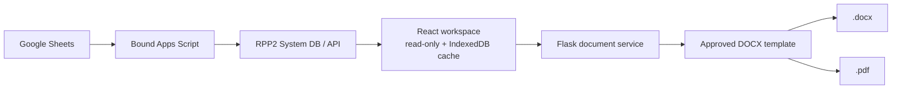

# ANF3 Laboratory Records

A controlled, read-only laboratory records workspace for water, air, compressed-air, and cleaning-validation workflows. ANF3 retrieves authoritative records from Google Sheets through Apps Script, previews them in a local web application, and produces controlled Word and PDF reports from approved templates.


## What ANF3 does

- Searches and reviews laboratory worksheets from the System Database.
- Supports PW/PRW, WFI/PUS, environmental monitoring, compressed air, CV contact plate, and CV rinse workflows.
- Keeps the browser read-only; record creation, numbering, and synchronization remain owner-managed in Google Sheets and Apps Script.
- Fills the authoritative DOCX template, converts it to PDF, and saves both files using the worksheet number.
- Provides two offline training simulations: The Sixth Plate and Excursion Trace.

## Architecture and workflow



1. **Capture and sync** — Operators create or update records in the owner-managed Google Sheets workflow. Apps Script routes records to the correct building shard and preserves worksheet-number contracts.
2. **Retrieve** — The frontend requests logical domain data from the API. It does not depend on physical shard names and does not write records.
3. **Select route** — The record’s `templateFamily`, `sampleMatrix`, and authoritative `testMethod` determine the form and DOCX template. CV rinse routes to Pour Plate or Membrane Filtration from `Test-Method`.
4. **Review** — The operator checks header fields and sample results in the browser. Missing source values remain blank; values are never invented.
5. **Generate** — The local Flask service maps record and sample fields to exact placeholders in the approved template, including legacy aliases and page-specific payloads.
6. **Export** — The filled document is saved as `words/<worksheetNo>.docx` and converted to `pdfs/<worksheetNo>.pdf`. Existing artifacts are compared by normalized content before regeneration.
7. **Verify** — Confirm that the files open, the PDF matches the DOCX, all expected placeholders are resolved, and multipage records repeat their header fields on every page.

## Quick start (Windows)

### For laboratory operators

1. Copy or extract the project folder to the department workstation.
2. Double-click [`START-ANF3.bat`](START-ANF3.bat). The launcher prepares a local Python environment and starts the application.
3. Open the printed local URL in a browser.
4. Search for a worksheet, review it, then choose **Print / Generate document**.
5. Find the generated files in `words/` and `pdfs/`.

Run [`INSTALL-MSOFFICE-SUPPORT.bat`](INSTALL-MSOFFICE-SUPPORT.bat) once when Microsoft Word is the selected DOCX-to-PDF converter.

### For developers

```powershell
pnpm install
pnpm dev       # Vite at http://127.0.0.1:5173
pnpm build     # creates dist/
pnpm check
pnpm test
```

In a second terminal, run [`START-SERVER.bat`](START-SERVER.bat) to start the Flask service on `127.0.0.1:8000`. The Vite development server proxies `/api` to it.

## Repository map

| Path | Purpose |
| --- | --- |
| `apps/web/src/` | Supported React application and workflow logic |
| `server/` | Flask API, DOCX filling, PDF conversion, activity log |
| `templates/` | Authoritative controlled Word templates |
| `google/app-scripts/` | Apps Script synchronization and RPP2 web apps |
| `validation/` | Contract, security, release, and wiring checks |
| `docs/` | Architecture and configuration contracts |
| `words/`, `pdfs/` | Local generated artifacts (do not commit) |
| `design-assets/` | Brand assets, including the ANF3 logo |

## Verification before release

```powershell
pnpm check
pnpm test
pnpm build
python -m pytest server/tests
node validation/test_cv_contract.mjs
node validation/test_worksheet_numbering.mjs
python validation/validate_release.py
```

Use `docs/GOAL.md` for the complete release checklist, browser interaction checks, and share-drive acceptance criteria.

## Data and safety rules

- The browser never mutates the System DB.
- Preserve worksheet numbers, `samplesJson`, exact placeholder spelling, and legacy aliases.
- Use the worksheet number as the external document identity.
- Do not fabricate results, tags, lots, equipment IDs, dates, or approvals.
- Do not commit credentials, production exports, or generated DOCX/PDF files.

## License and operational ownership

This repository is an internal laboratory application. Deployment configuration, Apps Script projects, templates, and production Sheets remain under the laboratory owner’s change control.
