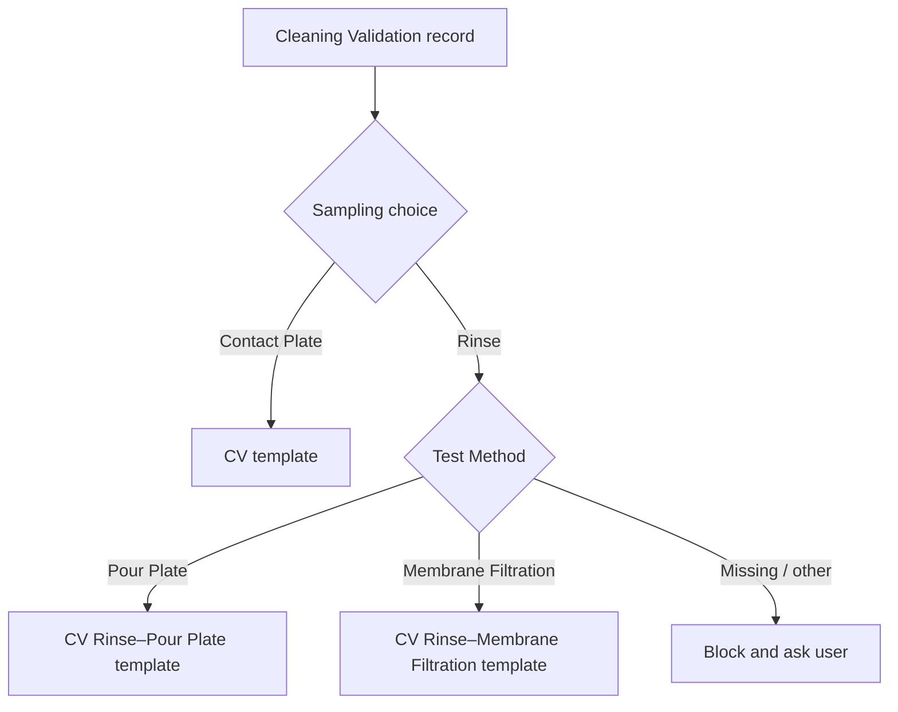

# Cleaning Validation Template Routing Contract

**Owner-approved:** 2026-09-02  
**Purpose:** Make CV document generation deterministic, explainable, and safe.

## 1. Entry point

Each Building 10/12/16 shelf has one `Cleaning Validation` binder. Opening it keeps the building filter and displays CV records plus a method-aware document action.

## 2. Routing decision tree

## 3. Normalized routing table

| Sampling family | Accepted normalized test method | Template route | PDF workflow key |
|---|---|---|---|
| Contact Plate | Contact Plate / not required | CV Contact template | `cleaning-validation-contact` |
| Rinse | Pour Plate | CV adapter over the approved PW / PRW template family | `cleaning-validation-rinse-pour` |
| Rinse | Membrane Filtration | CV adapter over the approved WFI / PUS template family | `cleaning-validation-rinse-membrane` |

Aliases such as workbook `Rinse-PW`, `Rinse-WFI`, `Memb. Filtration`, and case/spacing variants must be normalized through explicit allowlists. Do not fuzzy-map an unknown method.

## 4. Required user interaction

When the user chooses Preview/Print for CV:

1. Show record identity, building, sampling family, and existing test method.
2. Contact Plate: display `Template: Cleaning Validation` and continue.
3. Rinse: require a visible method selection:
   - Pour Plate
   - Membrane Filtration
4. If source data already provides one unambiguous allowed method, preselect it.
5. User confirms the route before generation.
6. Request includes the selected normalized route and CV context.

Do not hide this decision inside a generic dropdown. The two Rinse methods change the controlled template family and must be clear.

## 5. Backend validation

The local PDF service must independently validate the route:

- Contact Plate cannot request PW-PRW/WFI-PUS route.
- Rinse cannot request CV Contact template.
- Pour Plate can request only `cleaning-validation-rinse-pour`, which resolves to the approved PW / PRW template family through a CV adapter.
- Membrane Filtration can request only `cleaning-validation-rinse-membrane`, which resolves to the approved WFI / PUS template family through a CV adapter.
- Unknown/missing method is rejected.
- Client cannot provide an arbitrary template filename/path.

The template allowlist remains server-owned. The request carries a workflow key and CV context, never a filesystem path.

## 5.1 Template storage separation

The owner-approved decision is to reuse the two Water template files for CV Rinse. File ownership is shared by decision, while route ownership and data adapters remain separate from Water at the registry, workflow, audit, and validation levels.

CV route identities:

- `cleaning-validation-contact` -> `templates/cv-contact-template.docx`
- `cleaning-validation-rinse-pour` -> `templates/pw-prw-template.docx`
- `cleaning-validation-rinse-membrane` -> `templates/wfi-pus-template.docx`

Water retains its own workflow identities:

- `pw-prw` -> `templates/pw-prw-template.docx`
- `wfi-pus` -> `templates/wfi-pus-template.docx`

The route keys remain distinct from Water (`pw-prw` and `wfi-pus`) even when the resolved approved file and template hash are intentionally the same. A CV request must never become a Water request by submitting a filename or arbitrary path.

## 6. CV context adapter

The CV Rinse Pour adapter reuses the approved PW-PRW layout, and the CV Rinse Membrane adapter reuses the approved WFI-PUS layout. Each adapter must:

- map only approved fields;
- preserve CV worksheet number and record identity;
- map sample rows deterministically;
- never fabricate missing values;
- expose validation errors before document generation;
- include a test fixture for each route;
- retain copy-original template behavior.

Do not claim this routing is complete merely because the template file opens. The generated document must be visually and semantically checked with approved fixtures.

## 7. Audit metadata

Local generation log records:

- request ID;
- CV record key/worksheet number;
- selected sampling family;
- selected normalized test method;
- resolved template workflow key;
- template version/hash where available;
- outcome and safe error code.

No production record payload or absolute path is exposed to the browser log.

## 8. Tests

- Contact Plate → CV Contact template PASS.
- Rinse + Pour Plate → CV adapter over the approved PW / PRW template family PASS.
- Rinse + Membrane Filtration → CV adapter over the approved WFI / PUS template family PASS.
- CV Rinse and Water route keys/registry identities are distinct; shared file/hash identity is intentional and owner-approved.
- Rinse without method → blocked.
- Unknown method → blocked.
- Contact Plate requesting Rinse/Water template → blocked.
- Rinse requesting a Water workflow key or client-supplied template path → blocked; the approved Water template family is resolved only by the CV-owned adapter.
- Template-adapter missing required field → actionable validation error.
- Mobile selector and keyboard operation pass.
