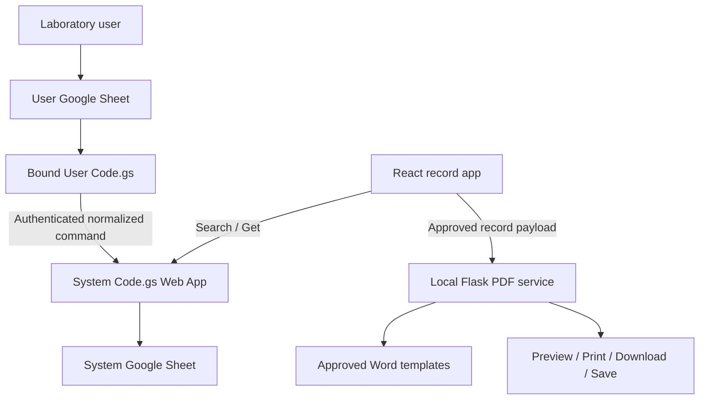

# ANF3 Laboratory Records — Full-Stack Architecture Specification

**Status:** Recommended baseline pending Gate A owner approval.  
**Scope:** Non-game application and its data/PDF/deployment infrastructure.  
**Primary principle:** Separate operational data entry, controlled system records, read-only web experience, and local document generation.

---

## 1. Recommended topology



Games are outside this topology and remain isolated from all record APIs/stores.

### Why this baseline

- Matches the current owner-controlled Sheets workflow.
- Keeps mutation credentials out of the browser.
- Centralizes numbering and active-store routing in the System project.
- Allows the web app to be read-only and safely cache reads.
- Preserves local Microsoft Word/PDF behavior where approved templates require it.
- Supports no-code deployment through bound Apps Script copy/paste and Windows one-click startup.

Any move to a cloud backend, direct browser mutation, alternate database, or Apps Script authentication model is a major change requiring Gate A approval.

---

## 2. Component boundaries

| Component | Owns | Must not own |
|---|---|---|
| React/Vite | navigation, cabinet/list UI, search/get, read cache, record presentation, PDF action orchestration | record mutation, tokens, numbering, arbitrary file paths |
| User `Code.gs` | Sheet menu, source validation, stable source ID, sync command, result writeback, optional trigger | target sheet selection, worksheet number allocation, public read API |
| System `Code.gs` | auth, validation, locks, numbering, routing, idempotent upsert, samples, audit log, read API | UI state, arbitrary caller-provided config, secrets in responses |
| System Sheet | normalized active records, legacy readable data, samples/logs/counter evidence | browser cache, generated PDFs |
| Flask | approved document generation, opaque output IDs, local download/save | primary record DB, Google token handling, arbitrary template execution |
| IndexedDB | read-only cached records/search pages and freshness metadata | editable drafts, pending mutations, tokens, PDF blobs, game state |

---

## 3. Six Google projects

| No. | Project/file | Bound Sheet role | Exposure |
|---:|---|---|---|
| 1 | `01-air-user/Code.gs` | Air operational input | Bound only |
| 2 | `02-air-system/Code.gs` | Air normalized DB + API | Web app |
| 3 | `03-water-user/Code.gs` | Water operational input | Bound only |
| 4 | `04-water-system/Code.gs` | Water normalized DB + API | Web app |
| 5 | `05-cv-user/Code.gs` | CV operational input | Bound only |
| 6 | `06-cv-system/Code.gs` | CV normalized parent/children + API | Web app |

Every project uses its own Script Properties. Air User/System share one Air mutation token; Water pair shares one Water token; CV pair shares one CV token. Tokens are generated/provided by the owner and never committed.

System URL storage:

- User script stores matching System `/exec` URL in Script Properties.
- Frontend build/runtime config stores read URLs only, under the owner-approved access model.
- No URL is inferred from spreadsheet ID.
- Setup helpers validate that a URL responds with the expected domain before saving it.

---

## 4. Authoritative write path

The rebuild must eliminate ambiguity between “browser local save + immediate POST” and “Sheet scheduled sync.” The default approved write path is:

`User Sheet edit → User Code.gs → System Code.gs → System active store`.

The React web app does not create or edit records. Legacy browser mutation code must not remain reachable from visible navigation. If legacy direct routes remain for one transition release, they must clearly redirect or show a retired-workflow notice and must not silently write through an old path.

### Sync command lifecycle

1. User script selects rows explicitly marked ready, or approved trigger selects eligible rows.
2. Validate required columns/values locally.
3. Ensure stable `sourceRecordId`; for grouped CV samples, ensure stable `sourceBatchId`/record grouping.
4. Normalize to versioned command schema.
5. Add `requestId` and content fingerprint; send token in header or body according to contract.
6. System authenticates and validates.
7. Acquire script lock.
8. Find existing record by stable identity.
9. Allocate a number only when a new record has no issued number.
10. Route to explicit active store, upsert, replace samples if applicable, and log.
11. Release lock and return stable identity/number/status.
12. User script writes back sync result to the original stable row identity, not an unverified stale row index.

### Stable source identity

Do not use row index as the durable idempotency key because inserted/deleted/sorted rows can move. An owner-approved hidden/protected source ID column is recommended:

- UUID created once per logical source record;
- never regenerated during retry/edit;
- CV sample rows use one record/batch ID plus a stable sample ID or deterministic sample order key;
- User script locates writeback row by source ID and verifies expected fingerprint before changing status.

If adding this column conflicts with real workbooks, stop at Gate B and ask.

---

## 5. Versioned mutation contract

Illustrative schema; exact field maps come from workbook audit.

```json
{
  "apiVersion": "2026-09-02",
  "action": "upsert",
  "domain": "water",
  "workflow": "pw-prw",
  "requestId": "uuid",
  "sourceRecordId": "stable-uuid",
  "sourceUpdatedAt": "ISO-8601",
  "record": {
    "worksheetNo": "",
    "building": "Building 10",
    "samplingDate": "2026-09-02"
  },
  "samples": [],
  "fingerprint": "sha256-or-stable-digest"
}
```

System response:

```json
{
  "ok": true,
  "status": 200,
  "data": {
    "operation": "inserted",
    "recordKey": "stable-system-key",
    "sourceRecordId": "stable-uuid",
    "worksheetNo": "WT-26-B10-0001",
    "targetClass": "active"
  },
  "meta": {
    "domain": "water",
    "requestId": "uuid",
    "processedAt": "ISO-8601",
    "timeZone": "Asia/Bangkok"
  }
}
```

Apps Script cannot reliably provide every conventional custom status code in all response modes, so include `status` in JSON and make clients evaluate `ok/status`. Network/HTML/auth redirect responses must be detected as contract failures.

### Mutation rules

- Only `upsert` and explicitly approved admin actions exist.
- Browser-originated mutation is rejected by architecture, not merely hidden UI.
- Unknown fields are rejected or ignored according to an explicit per-workflow allowlist; choose and document one behavior.
- Existing worksheet number cannot be overwritten by payload.
- Deletion, if retained, must be explicit, admin-only, auditable, active-store-only, and owner-approved. Prefer archive/status over hard delete.

---

## 6. Read API

### Health

`GET ?action=health`

Returns domain, API version, time zone, implementation version, and non-sensitive schema readiness. Do not expose spreadsheet IDs, tab lists, properties, or stack traces.

### Search

`GET ?action=search&workflow=<id>&building=<id>&q=<text>&from=<yyyy-mm-dd>&to=<yyyy-mm-dd>&cursor=<opaque>&limit=<1..100>`

Rules:

- Allowlist workflows/buildings/search/sort fields.
- Clamp `limit` to 100.
- Validate dates and maximum range if needed.
- Cursor is opaque and signed/validated or a safe bounded offset representation.
- Read aggregation includes active shards and permitted legacy backup.
- De-duplicate by canonical identity; define precedence when an active and legacy row collide.
- Sort deterministically with a tie-breaker.

### Get

`GET ?action=get&workflow=<id>&recordKey=<encoded-id>`

Returns one normalized record and samples. Record key validation must block arbitrary sheet/range injection.

### Response envelope

```json
{
  "ok": true,
  "data": {},
  "meta": {
    "domain": "air",
    "workflow": "em-air",
    "fetchedAt": "ISO-8601",
    "timeZone": "Asia/Bangkok",
    "apiVersion": "2026-09-02"
  },
  "status": 200
}
```

Access to reads is an owner/organization decision. Luna must not silently deploy an `Anyone` endpoint to make CORS/auth easier.

---

## 7. Storage, routing, and legacy data

### Air active allowlist

- `records_em_B10`, `records_em_B12`, `records_em_B16`, `records_em_OT`
- `records_ca_B10`, `records_ca_B12`, `records_ca_B16`, `records_ca_OT`

### Water active allowlist

- `records_pw_prw_B10`, `records_pw_prw_B12`, `records_pw_prw_B16`, `records_pw_prw_OT`
- `records_wfi_B10`, `records_wfi_B12`, `records_wfi_B16`, `records_wfi_OT`

### CV stores

- `records_cv`
- `records_cv_samples`
- log/audit tab confirmed from actual workbook

### Legacy

- Unsuffixed routine Air/Water tabs remain readable.
- New mutations never write to them.
- Mutation APIs never move or delete legacy data.
- An update locates an existing issued record across its allowed current storage and preserves its existing number/location unless Gate B approves a formal migration.

Setup functions may create only exact missing tabs that the owner approved at Gate B, with exact headers from a versioned schema. They must refuse to overwrite a nonempty mismatched tab.

---

## 8. Worksheet number allocation

### Algorithm

Within the System lock:

1. Normalize workflow/prefix/building and Bangkok year.
2. If record exists with worksheet number, preserve it.
3. If payload contains an existing number, validate it and reconcile only under explicit rules; client cannot allocate a new number.
4. Determine counter scope.
5. Read next counter candidate from Script Properties or approved counter table.
6. Scan/check all relevant active and legacy locations for collision.
7. Advance until unused.
8. Persist counter and record mutation in the controlled operation.
9. Log allocation reason and scope.

PropertiesService alone is not transactionally coupled to Sheet writes, so recovery behavior must be explicit. Gaps are acceptable; duplicates are not. A failed record write after counter advance may leave a gap and must never reuse that number automatically.

### Immutable rule

Changing building after issue does not renumber or automatically move. Log `BUILDING_CHANGED_AFTER_ISSUE` with old/new normalized values. Any formal correction is an owner-approved administrative process.

---

## 9. Audit logging

Minimum fields:

- event timestamp (`Asia/Bangkok` + ISO representation)
- run/request ID
- domain/workflow
- operation and outcome
- stable source/system record IDs
- worksheet number
- target class or safe logical shard code
- actor class (`user-script`, `trigger`, `admin-helper`); avoid unreliable personal email assumptions
- before/after fingerprint or changed-field names
- error code and safe message
- duration

Never log token, full payload, sensitive record content, Script Properties, deployment URL, or stack trace into a user-visible sheet.

---

## 10. Frontend architecture

### Route model

- `#/` — Cabinet/List home
- `#/records/:domain` — workflow/building selector or redirect to configured view
- `#/records/:domain/:workflow?building=B10` — filtered record list
- `#/records/:domain/:workflow/:recordKey` — record detail
- existing non-game support routes as approved
- existing Games routes unchanged

### Configuration model

Create one typed domain configuration source containing:

- building ID/name/color/asset;
- workflow ID/domain/name/icon;
- availability by building;
- read endpoint key;
- PDF workflow capability;
- routes and feature states.

Do not duplicate mapping across 3D scene, list view, API, and CSS.

### Read cache

Dedicated IndexedDB, schema-versioned:

- `records` keyed by domain/workflow/recordKey;
- `searchPages` keyed by normalized filters/cursor;
- `metadata` for last successful endpoint fetch and schema version.

Cache never enables mutation. A cached record is labeled read-only and PDF actions remain disabled until a current-session fresh get succeeds, per approved policy.

### Service health

Track independently:

- browser network reachability;
- Air read API;
- Water read API;
- CV read API;
- local Flask/PDF service.

Display last success and actionable failure. Use timeouts and abort stale requests.

---

## 11. Local Flask architecture

### Allowed responsibilities

- Serve production-built frontend/static assets.
- Health endpoint.
- Generate approved documents from explicit workflow/template map.
- Serve generated file by opaque ID.
- Download and explicitly save to Desktop.
- Inventory catalog status/read functions already verified, if kept.

### Required controls

- Bind `127.0.0.1`; a LAN bind requires owner approval and additional auth/firewall review.
- Maximum JSON body 2 MB unless a proven approved payload requires another bounded limit.
- Validate worksheet number/filename components.
- Resolve templates from server-owned allowlist.
- Generate into controlled output directory.
- Never accept or return arbitrary absolute path.
- Store opaque ID → file metadata with expiry/cleanup strategy.
- Prevent overwrite unless user confirms through separate request.
- Safe Windows filename and reserved-name handling.
- No debug server in production.

### Document truth

- Contact Plate, PW/PRW, WFI/PUS, Compressed Air, EM Air use only approved template registry entries.
- CV Rinse is a separate controlled route family: `cleaning-validation-rinse-pour` and `cleaning-validation-rinse-membrane`.
- CV Rinse route keys and adapters are CV-owned; the owner-approved resolved template families are `pw-prw-template.docx` and `wfi-pus-template.docx`, shared with Water by decision.
- The browser sends only an allowlisted workflow key and normalized CV context; it never sends a template path.
- Missing/unknown CV Rinse method is blocked before generation. The service independently revalidates the selection.
- PDF/Word tests on non-Windows can validate contracts but do not replace a real Microsoft Word smoke test on the deployment PC.

---

## 12. Security model

### Threats to test

- leaked/hardcoded mutation token;
- unauthenticated mutation;
- arbitrary sheet or spreadsheet access;
- formula injection;
- replay creating duplicate/renumbered records;
- malicious/oversized query or payload;
- path traversal/template selection;
- public read exposure beyond approved policy;
- error/config leakage;
- legacy tab mutation;
- cross-domain URL/token mix-up.

### Minimum controls

- Secrets in Script Properties, never frontend/source.
- Constant-time-equivalent comparison where practical in Apps Script; at minimum no token logging/echo.
- Explicit domain/workflow/action/field/tab allowlists.
- LockService around controlled mutation.
- Idempotency and immutable numbers.
- Formula-safe writes for untrusted text.
- Bounded search and request sizes.
- Content Security Policy appropriate to deployment, with no unsafe remote assets where feasible.
- Dependency audit and pinned lockfile.
- Production errors return safe codes/messages.

---

## 13. Deployment options requiring Gate A

### Option A — Windows local app + Apps Script (recommended)

- Best match for local Word templates and no-code owner.
- Local data/PDF service remains on one PC.
- Requires Apps Script read access model compatible with the app.

### Option B — Static hosted frontend + local PDF companion

- Easier access to record browsing from multiple PCs.
- PDF save/Word generation remains local and requires companion discovery/security design.
- Cross-origin/auth complexity increases.

### Option C — Fully hosted redesign

- Not a minor change; requires new backend, auth, secret management, file/template strategy, privacy review, and likely organizational IT involvement.
- Do not implement without explicit scope/budget/owner approval.

The final architecture document must describe the chosen option only as implemented and list rejected alternatives in `DECISION_LOG.md`.

---

## 14. Observability and support

- Frontend diagnostic panel shows version, build time, endpoint health, and last success without secrets.
- Flask logs structured request ID, workflow, result, duration, and safe error code.
- Apps Script audit logs include run ID and mutation outcome.
- Owner guide explains where to inspect Apps Script Executions, Triggers, Script Properties, System logs, and local server logs.
- Provide a one-click export of non-sensitive diagnostics only if implemented and tested; do not add it as a placeholder.

---

## 15. Architecture acceptance checklist

- One authoritative write path.
- Six clear project boundaries.
- No browser mutation secret or route.
- Idempotent retry and immutable number tests pass.
- Active/legacy boundaries enforced.
- Read access matches owner-approved policy.
- Local server path/template controls pass.
- Cache is read-only and honest.
- Games remain isolated and unchanged.
- No duplicate hand-maintained production Apps Script source.
