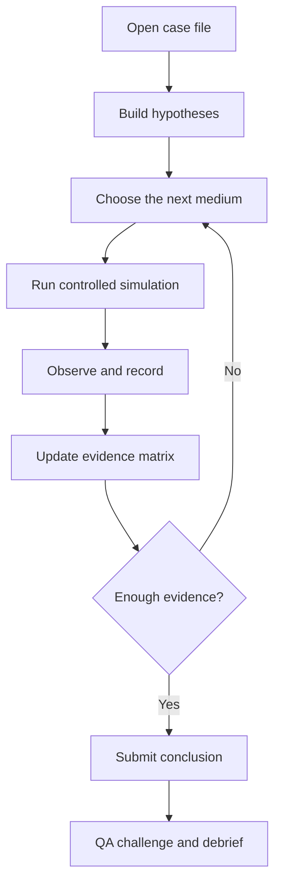

# Bacterial Identification Investigation Game

## Detailed Game Design & Web-App Implementation Specification

**Working title:** `The Sixth Plate: Microbial Case Files`  
**Alternative title:** `Culture Trace`  
**Document status:** Implementation-ready concept specification v1.0  
**Genre:** Evidence-driven laboratory investigation / deduction game  
**Primary platform:** Desktop-first responsive web app  
**Recommended renderer:** Three.js laboratory diorama + HTML/CSS evidence interface  
**Allowed culture media in v1:** TSB, SDA, MSA, MacConkey agar, Rappaport–Vassiliadis medium, and XLD agar only  

---

## 1. High concept

A pharmaceutical microbiology laboratory has detected an unexpected culture result. The player is the investigation analyst assigned to reconstruct what happened, choose a limited sequence of media, observe growth patterns, compare evidence, and issue a scientifically calibrated conclusion.

The game is designed around a principle that most identification games ignore:

> **Selective and differential media narrow a hypothesis; they rarely prove species identity by themselves.**

Therefore the player is not rewarded for confidently naming an organism from one colorful plate. The player is rewarded for:

- Building a defensible hypothesis set.
- Choosing media that separate competing hypotheses.
- Reading both growth and non-growth evidence.
- Recognizing when an enrichment step changes the evidentiary value of a later plate.
- Separating observation from interpretation.
- Identifying contamination, mixed culture, and process errors.
- Saying `presumptive`, `cannot resolve with available media`, or `confirmation required` when appropriate.

The result should feel like an investigative game, but it must remain calm, credible, and suitable for laboratory education. The atmosphere comes from an after-hours lab, evidence lighting, a case wall, and deliberate camera movement—not from horror, police clichés, or a cyberpunk interface.

---

## 2. Scope and scientific boundary

### 2.1 The six-media constraint

The first release uses only:

1. **TSB — Tryptic Soy Broth / soybean–casein digest broth**
2. **SDA — Sabouraud Dextrose Agar**
3. **MSA — Mannitol Salt Agar**
4. **MacConkey agar — abbreviated `MAC` in the UI**
5. **Rappaport–Vassiliadis medium — abbreviated `RV`; represented as a selective enrichment broth**
6. **XLD agar — Xylose Lysine Deoxycholate Agar**

The UI must never call all six “identification agars.” TSB and RV are broths in this design. SDA primarily supports recovery/observation of yeasts and molds and functions as a fungal clue or rule-out path. MSA, MAC, and XLD are selective/differential plates whose reactions provide presumptive evidence.

### 2.2 What counts as winning

A mission is solved when the player submits the **most specific claim justified by the available evidence**, not necessarily a species name.

Valid conclusion levels:

```ts
type ConclusionLevel =
  | 'observation_only'
  | 'broad_group'
  | 'presumptive_organism'
  | 'mixed_culture_suspected'
  | 'non_bacterial_growth_suspected'
  | 'cannot_resolve_with_available_media'
  | 'confirmation_required';
```

### 2.3 Prohibited claims

- No clinical diagnosis.
- No definitive patient-pathogen report.
- No assertion that colony color equals species identity.
- No claim that absence of visible growth proves absence under all methods.
- No free-form real-world pathogen cultivation sandbox.
- No replacement for a validated method, current compendium, site SOP, biochemical identification, MALDI-TOF, sequencing, serology, or qualified microbiologist review.

### 2.4 Training disclaimer

Display at first launch, in settings, and in exported case reports:

> Educational simulation only. Media reactions are simplified, scenario-controlled evidence. Real isolates can be atypical, and confirmatory identification must follow the current approved laboratory procedure.

---

## 3. Learning objectives

By the end of the campaign, the player should be able to:

1. Categorize TSB, SDA, MSA, MAC, RV, and XLD by functional role.
2. Explain what visible growth, lack of growth, color change, colony color, turbidity, and black-center formation can and cannot support.
3. Create an efficient test sequence that distinguishes Gram-positive salt-tolerant candidates, Gram-negative enteric candidates, a possible Salmonella-like pattern, and fungal contamination.
4. Understand that RV is an enrichment step whose value is interpreted through subsequent plating rather than a species-ID color reaction in the broth itself.
5. Compare pre-enrichment and post-enrichment evidence without treating enrichment as proof.
6. Recognize common presumptive patterns while keeping atypical reactions possible.
7. Detect mixed cultures and chain-of-custody or labeling defects.
8. Write a conclusion with an evidence-linked confidence level and a confirmation plan.

---

## 4. Narrative premise

The game takes place in the fictional `North River Quality Laboratory`. A batch, utility sample, raw material, or environmental monitoring point produces an unexpected finding. Production is waiting, but the laboratory manager refuses to accept an overconfident answer.

The player receives a sealed `Case File` containing:

- Sample origin.
- Chain-of-custody events.
- Initial observation.
- Candidate hypotheses.
- Available media inventory.
- Time/action budget.
- Consequence of a false positive, false negative, or unjustified definitive claim.

The campaign follows recurring characters through documents and voice notes:

- **Dr. Mira Voss — Lab Manager:** sets the investigation question.
- **Narin — Senior Analyst:** provides procedural context but never the answer.
- **Quinn — QA Reviewer:** challenges unsupported language.
- **The player — Investigation Analyst:** chooses tests and owns the conclusion.

Characters should appear as restrained illustrated portraits or voice-only messages. Do not build animated humanoids in v1.

---

## 5. Core gameplay loop



Average mission: **12–20 minutes**.  
Capstone mission: **25–35 minutes**.

The player has a limited but forgiving action budget. A redundant test costs time and score, but a necessary repeat after an invalid control does not receive the same penalty.

---

## 6. The laboratory as an investigation board

### 6.1 Scene concept

The whole application is one coherent Three.js laboratory diorama viewed from fixed cinematic anchors. Instead of navigating menus, the player moves among four stations:

| Station | Purpose | Three.js objects | HTML overlay |
|---|---|---|---|
| Case desk | Understand incident and chain of custody | Folder, seal bag, tablet, map card | Case file and timeline |
| Media cabinet | Select next evidence-producing action | Six labeled media zones | Test planner and cost |
| Incubation/observation bench | Watch controlled time-lapse and inspect results | Tube rack, incubator, plate viewer | Observation form |
| Evidence wall | Compare hypotheses and submit conclusion | Pinboard/monitor with cards and lines | Evidence matrix and report |

### 6.2 Art direction: “Quiet investigation after hours”

- Desaturated warm-gray room.
- Focused bench lamps.
- Outside window transitioning from dusk to night.
- Muted red safety light only near the incubator.
- Manila case folders, white labels, stainless surfaces.
- Soft amber for unresolved evidence.
- Sage for completed evidence.
- No police tape, blood imagery, horror motifs, neon grids, or futuristic holograms.

### 6.3 Camera

- Four fixed anchors plus plate/tube close-up.
- 0.7-second damped transitions.
- Very shallow parallax.
- Plate inspection allows constrained rotation and zoom only.
- Pressing `E` opens the evidence matrix; `Esc` returns to room view.
- Full keyboard and 2D fallback support.

---

## 7. Media mechanics

The following table is an **educational gameplay model**, not a universal identification table. Each scenario may include typical or atypical variants.

| Medium | Role in the game | Observable evidence | What it may support | What it cannot prove alone |
|---|---|---|---|---|
| TSB | Broad enrichment/recovery broth | Clear, turbid, equivocal, sediment/pellicle state if scripted | Viable organism grew under the scenario condition | Organism identity; purity |
| SDA | Fungal recovery/observation plate | Yeast-like or mold-like colony morphology | Possible fungal contamination or non-bacterial lead | Definitive fungal ID; absence of bacteria in general |
| MSA | Selective/differential plate | Growth/no growth; medium/colony-associated yellow reaction or unchanged red-pink field | Salt-tolerant organism; mannitol-positive/negative pattern | Definitive `S. aureus` or Staphylococcus species ID |
| MAC | Selective/differential plate | Growth/no growth; pink/red versus pale/colorless colonies | Gram-negative enteric-compatible growth and lactose reaction pattern | Species identity; exclusion of every Gram-positive organism |
| RV | Selective enrichment broth | Enrichment outcome inferred by downstream comparison | Increased support for a Salmonella-like hypothesis when paired with XLD pattern and valid controls | Direct species ID from broth appearance |
| XLD | Selective/differential plate | Yellow, red/pink, black-centered, near-black, or atypical scripted colonies | Enteric differentiation and a presumptive Salmonella-/Shigella-like pattern | Definitive species/serovar ID |

### 7.1 Critical UX rule for RV

The RV tube does not display a magic “Salmonella detected” label. The player must subculture the **simulated RV result to XLD** using a linked action. The evidence wall then distinguishes:

- `Direct XLD from initial enrichment`.
- `XLD after RV enrichment`.

This creates a meaningful investigation sequence and teaches that enrichment changes probability, not certainty.

### 7.2 Observation vocabulary

The player records standardized observations before interpretation:

```ts
interface CultureObservation {
  medium: 'TSB' | 'SDA' | 'MSA' | 'MAC' | 'RV' | 'XLD';
  growth: 'none_visible' | 'present' | 'equivocal';
  abundance: 'not_applicable' | 'sparse' | 'moderate' | 'heavy';
  colonyColor?: 'pink_red' | 'pale_colorless' | 'yellow' | 'cream' | 'black_centered' | 'other';
  mediumReaction?: 'yellowing' | 'unchanged' | 'other' | 'not_applicable';
  morphotypes: 0 | 1 | 2 | 3;
  confidence: 'high' | 'moderate' | 'low';
  note?: string;
}
```

Interpretive labels become available only after the objective fields are committed.

---

## 8. Educational organism/candidate library

Use a compact candidate library so the deduction remains learnable. Names represent scenario hypotheses, not operational claims.

### Core candidate set

1. `Staphylococcus aureus-like`
2. `Coagulase-negative Staphylococcus-like`
3. `Escherichia coli-like lactose fermenter`
4. `Salmonella enterica-like`
5. `Shigella-like non-H2S enteric`
6. `Gram-negative non-lactose-fermenter, unresolved`
7. `Yeast-like contaminant`
8. `Mold-like contaminant`
9. `Mixed culture`
10. `No interpretable viable recovery`

### Simplified typical-pattern matrix

This matrix drives introductory missions only. Later variants may alter one reaction and require the learner to lower confidence.

| Candidate | TSB | SDA | MSA | MAC | RV → XLD | Direct XLD | Maximum justified claim with these media |
|---|---|---|---|---|---|---|---|
| `S. aureus-like` | Growth | Not primary evidence | Growth + mannitol-positive pattern | Usually inhibited/no useful growth | No Salmonella-like enrichment pattern | Usually inhibited/no useful pattern | Presumptive salt-tolerant, mannitol-positive Staphylococcus-like organism |
| CoNS-like | Growth | Not primary evidence | Growth + mannitol-negative pattern | Usually inhibited/no useful growth | No Salmonella-like enrichment pattern | Usually inhibited/no useful pattern | Presumptive salt-tolerant, mannitol-negative Staphylococcus-like organism |
| `E. coli-like` | Growth | Not primary evidence | Usually inhibited | Growth + lactose-positive pink/red pattern | No characteristic enrichment advantage | Fermenter-compatible yellow pattern may occur | Presumptive lactose-fermenting Gram-negative/enteric-compatible organism |
| `Salmonella-like` | Growth | Not primary evidence | Usually inhibited | Growth + non-lactose-fermenting pale/colorless pattern | Enrichment followed by typical red/pink ± black-centered XLD pattern | Typical or sometimes atypical pattern | Presumptive Salmonella-like organism; confirmation required |
| `Shigella-like` | Growth | Not primary evidence | Usually inhibited | Growth + pale/colorless pattern | No reliable Salmonella-specific advantage in the game profile | Red/pink without black center in typical variant | Presumptive Shigella-like/non-H2S enteric; confirmation required |
| Unresolved GNR | Growth | Not primary evidence | Usually inhibited | Often pale/colorless | Variable | Variable | Gram-negative non-lactose-fermenter unresolved |
| Yeast-like | May be variable | Yeast-like colonies | Not relied upon | Not relied upon | Not relied upon | Not relied upon | Non-bacterial/yeast-like growth suspected |
| Mold-like | May be variable | Filamentous mold-like colonies | Not relied upon | Not relied upon | Not relied upon | Not relied upon | Non-bacterial/mold-like growth suspected |

The game must expose a tooltip beside this table in instructor mode:

> Real isolates can produce atypical reactions. This matrix is a scenario model, not a standalone identification key.

---

## 9. Hypothesis and evidence system

### 9.1 Hypothesis cards

At mission start, the player selects 2–5 active hypotheses. Each card shows:

- Candidate label.
- Prior support from case context.
- Evidence that would increase support.
- Evidence that would weaken support.
- Common confounder.
- Maximum claim level.

### 9.2 Evidence weights

Use deterministic ordinal weights, not fake Bayesian precision:

```ts
type EvidenceWeight = -3 | -2 | -1 | 0 | 1 | 2 | 3;
```

- `+3`: strongly supports within the controlled scenario.
- `+1/+2`: compatible/moderately supportive.
- `0`: non-discriminating.
- `-1/-2`: weakens.
- `-3`: conflicts, unless an atypical variant is active.

The engine knows the scenario truth but scores the player's claim based on **evidence sufficiency**, not whether the guessed name matches the hidden truth.

### 9.3 Epistemic confidence

Player selects:

- Low confidence.
- Moderate confidence.
- High confidence.

High confidence is penalized when evidence is ambiguous. Low confidence is mildly penalized when the scenario provides a clean, multi-step presumptive pattern. This teaches calibration rather than timidity.

---

## 10. Test planning as information gain

At the media cabinet, each available action shows:

- Media name and type.
- Virtual time cost.
- Consumable cost.
- Which unresolved hypotheses it may discriminate.
- Whether a prerequisite exists.

Do not reveal expected results.

### Example decision

Current hypotheses:

- `E. coli-like`.
- `Salmonella-like`.
- `S. aureus-like`.

Reasonable sequence:

1. TSB to establish broad recovery if required by the mission.
2. MSA versus MAC to separate salt-tolerant Gram-positive-compatible and Gram-negative-enteric-compatible patterns.
3. If MAC is pale/colorless, use RV followed by XLD to investigate a Salmonella-like hypothesis.

An inefficient sequence is not blocked; it consumes budget and appears in the debrief.

---

## 11. Case campaign

### Case 0 — Media room orientation

**Question:** Which vessels are broth, which are plates, and what kind of evidence can each produce?

The player physically places six media items into:

- Broad recovery.
- Fungal observation.
- Selective/differential plate.
- Selective enrichment broth.

This case establishes that RV is not an agar and that SDA is not the primary bacterial identification plate.

### Case 1 — The yellow bench isolate

**Setup:** A cream-colored isolate from a frequently touched surface produces TSB growth.  
**Hypotheses:** `S. aureus-like`, CoNS-like, Gram-negative lactose fermenter.  
**Useful media:** MSA and MAC.  
**Typical solution:** Growth with a mannitol-positive MSA reaction and no useful MAC growth supports a salt-tolerant, mannitol-positive Staphylococcus-like hypothesis.  
**Required report language:** `Presumptive ...; confirmatory identification required.`  
**Trap:** Reporting definitive `S. aureus` from MSA alone.

### Case 2 — Pink is not a surname

**Setup:** A raw-material sample yields TSB turbidity and pink/red colonies on MAC.  
**Hypotheses:** `E. coli-like lactose fermenter`, another lactose-fermenting Gram-negative organism, mixed culture.  
**Useful media:** MAC, XLD, plate purity review.  
**Correct learning:** A lactose-positive pattern narrows the group but does not prove `E. coli`.  
**Best possible conclusion:** `Presumptive lactose-fermenting Gram-negative/enteric-compatible organism; unresolved to species with the available media.`

### Case 3 — The black center

**Setup:** A product-related sample produces pale colonies on MAC. Direct XLD is equivocal.  
**Hypotheses:** Salmonella-like, Shigella-like, unresolved non-lactose-fermenter.  
**Useful sequence:** RV enrichment followed by XLD, with valid controls.  
**Typical evidence:** Increased recovery of red/pink colonies with black centers after RV supports a Salmonella-like hypothesis.  
**Required conclusion:** Presumptive only; confirmation required.  
**Trap:** Treating black centers alone as definitive or ignoring an atypical possible pattern.

### Case 4 — Red without black

**Setup:** Pale MAC colonies and red/pink XLD colonies without black centers.  
**Hypotheses:** Shigella-like, Salmonella variant lacking the typical reaction, unresolved non-lactose-fermenter.  
**Correct learning:** Available media are insufficient for definitive resolution.  
**Winning report:** `Presumptive non-lactose-fermenting enteric-compatible organism; Shigella-like pattern considered; confirmation required.`

### Case 5 — The colony that should not be here

**Setup:** TSB is turbid, but selective bacterial plates give inconsistent sparse results. SDA develops a distinct yeast-like or mold-like morphotype.  
**Correct learning:** Investigate possible non-bacterial contamination or mixed recovery; do not force a bacterial ID.  
**Trap:** Choosing the “closest bacterium” because the game title says bacterial identification.

### Case 6 — Two answers in one plate

**Setup:** MAC shows two morphotypes: pink/red and pale/colorless.  
**Correct action:** Flag mixed culture, isolate purity problem, or sample mixture within the scenario; do not average the reactions.  
**Gameplay:** The evidence wall splits into two isolate tracks (`A` and `B`).  
**Constraint:** The player may spend one controlled re-isolation action represented abstractly; no free-form wet-lab technique.

### Case 7 — The wrong tube

**Setup:** RV-to-XLD sequence looks convincing, but the chain-of-custody timeline shows a tube-label swap.  
**Correct action:** Invalidate the identity link and investigate/repeat under procedure.  
**Learning:** Strong biological evidence cannot repair broken traceability.

### Case 8 — Atypical capstone

One expected reaction is atypical. The player must:

- Notice the contradiction.
- Avoid forcing the hidden truth.
- Submit a bounded hypothesis.
- Identify that additional approved confirmatory work is required.

This case separates real scientific reasoning from memorizing a color chart.

---

## 12. Case variants and replayability

Each case can randomize:

- Sample origin and consequence context.
- Candidate set.
- Colony density and positions.
- One atypical reaction.
- Mixed-culture probability.
- Document/label defect.
- Control failure.
- Condensation or lighting difficulty.
- Inventory constraint.

Randomness must be deterministic from a shareable seed.

```ts
interface CaseSeed {
  caseId: string;
  variant: number;
  seed: string;
  scientificProfileId: string;
}
```

---

## 13. Three.js culture visualization

### 13.1 Plates

Use an instanced colony renderer:

```ts
interface ColonyRenderState {
  seed: string;
  count: number;
  distribution: 'streak_zones' | 'scattered' | 'clustered' | 'edge_bias';
  morphotypeId: string;
  growthProgress: number; // 0..1 visual timeline only
  colonyMaterialId: string;
  centerMaterialId?: string;
}
```

Required plate states:

- No visible colonies.
- One morphotype.
- Two morphotypes.
- Pink/red lactose-positive pattern on MAC.
- Pale/colorless pattern on MAC.
- MSA yellow reaction field.
- MSA unchanged red/pink field.
- XLD yellow colonies/field.
- XLD red/pink colonies.
- XLD red/pink with black centers.
- Near-black colony variant.
- Yeast-like creamy colonies on SDA.
- Mold-like radial/filamentous colony on SDA.

Do not pursue photorealistic pathogen imagery. Use scientifically legible stylization with consistent scale and objective text descriptions.

### 13.2 Broths

TSB and RV tube states:

- Clear.
- Slight haze/equivocal.
- Uniform turbidity.
- Scripted sediment or surface film as a non-specific observation.
- Label, tube ID, and linked-source tag.

Turbidity is a volumetric shader state; it must not reveal an organism name.

### 13.3 Time-lapse

- Player selects a scenario-approved observation checkpoint.
- Animation compresses the controlled interval into 4–8 seconds.
- Colony growth uses seeded scale interpolation and limited opacity transition.
- Camera stays steady so the player can compare before/after.
- A timeline scrubber is available only after the observation is complete and is labeled `Simulation replay`, not real growth kinetics.

---

## 14. Controls, invalidity, and investigation integrity

Every culture action may require predefined controls according to the case profile.

The rules engine must represent:

```ts
type EvidenceValidity =
  | 'valid'
  | 'invalid_control_failure'
  | 'invalid_label_mismatch'
  | 'invalid_chain_of_custody'
  | 'invalid_timing'
  | 'mixed_culture_unresolved'
  | 'equivocal';
```

### Mandatory behavior

- A failed uninoculated control blocks a definitive interpretation of that media session.
- A label swap breaks the evidence link even if the plate pattern is typical.
- Mixed morphotypes prevent a single-isolate conclusion until the scenario provides a valid split track.
- An equivocal plate cannot be silently converted to positive or negative.
- Repeating an invalid action requires a documented reason but receives no “wasteful test” penalty.

---

## 15. Evidence wall design

The evidence wall is the heart of the investigation game.

### 15.1 Layout

Columns are hypotheses. Rows are evidence items. Cells show:

- Supports.
- Compatible but weak.
- Neutral.
- Conflicts.
- Invalid/unusable.

The player initially assigns the evidence meaning. The game reveals the calibrated review only after case submission.

### 15.2 Evidence cards

Each card includes:

- Evidence ID.
- Source vessel and media lot.
- Objective observation.
- Player interpretation.
- Validity state.
- Time and chain-of-custody link.
- Confidence.

### 15.3 No decorative string-board clutter

Evidence relationships may be represented with thin lines only when selected. The default wall uses a readable grid. Avoid a cinematic corkboard full of crossing red strings.

---

## 16. Conclusion report

The final report contains:

1. Investigation question.
2. Sample/chain-of-custody status.
3. Objective culture observations.
4. Invalid or excluded evidence.
5. Leading hypothesis.
6. Alternative hypotheses still compatible.
7. Conclusion level.
8. Confidence.
9. Required next action.
10. Evidence-linked rationale.

### Allowed next actions

- Confirm according to approved identification procedure.
- Repeat because session validity failed.
- Resolve chain-of-custody discrepancy.
- Separate mixed culture using the case's abstracted purity workflow.
- Report no interpretable recovery under the simulated conditions.
- Escalate to QA/lab manager.

### Language guardrail

The deterministic report linter flags:

- `identified as` when maximum supported level is presumptive.
- Species name without `presumptive` or confirmation plan.
- A conclusion based only on one non-specific broth.
- An organism claim from invalid evidence.
- Failure to mention mixed culture.

---

## 17. Scoring

Total: 100 points.

| Domain | Weight | What is assessed |
|---|---:|---|
| Hypothesis quality | 15 | Plausible initial set; avoids tunnel vision |
| Test strategy | 20 | Discrimination value, prerequisites, efficiency |
| Observation accuracy | 20 | Growth, color, morphotype, broth state |
| Evidence integrity | 15 | Controls, labels, chain of custody, validity |
| Conclusion calibration | 25 | Claim specificity, confidence, alternatives, confirmation |
| Documentation | 5 | Evidence-linked, concise, reconstructable report |

### Major penalties

- `-25`: Definitive species claim from one selective/differential plate.
- `-25`: Uses invalid evidence without qualification.
- `-20`: Misses a mixed culture.
- `-15`: Treats RV turbidity as direct Salmonella identification.
- `-15`: Calls SDA a bacterial identification agar and ignores fungal morphology.
- `-10`: Repeats a valid non-discriminating test without rationale.

### Positive bonuses

- `+5`: Correctly reports `cannot resolve with available media` in an ambiguous case.
- `+5`: Chooses a high-information sequence under budget.
- `+5`: Detects a traceability defect before spending additional media.

Final score is capped at 69 if the submitted conclusion exceeds the maximum scientifically supported claim.

---

## 18. Difficulty modes

### Apprentice

- Media-role labels visible.
- Hypothesis cards suggest discriminating evidence.
- Objective morphology descriptions available automatically.
- No atypical variants.

### Analyst

- Media roles available through a reference drawer.
- One distracting hypothesis.
- Optional control/document defect.
- Feedback after submission.

### Investigator

- One atypical reaction.
- Mixed culture or traceability complication possible.
- Limited action budget.
- Player must write calibrated conclusion language.

### Audit mode

- Player reviews another fictional analyst's completed case.
- Must find unsupported statements, missing evidence, and overconfident wording.
- No bench actions; useful for QA learners.

---

## 19. User experience details

### 19.1 Persistent case bar

- Case number and title.
- Virtual deadline.
- Actions remaining.
- Evidence collected.
- Current chain-of-custody status.
- Notebook and settings.

### 19.2 Media cabinet interaction

Each medium has a physical shape and color-coded cap/label, but always includes text. On hover/focus:

- Full medium name.
- `Broth` or `Agar plate`.
- General function.
- Prerequisite, if any.
- Cost/time.

### 19.3 Observation mode

- Split view: 3D plate/tube left, structured observation form right.
- Light toggle: top / oblique / transmitted where visually relevant.
- Zoom limited to a useful range.
- `Describe objectively` accessibility control.
- Interpretation choices remain locked until objective fields are saved.

### 19.4 Notebook

The notebook records original entries and amendments. No erase operation exists; corrected entries retain an audit history.

---

## 20. Technical architecture

### 20.1 Recommended stack

- Vite + TypeScript.
- Three.js.
- React only if useful for the evidence-heavy UI; otherwise Lit or vanilla TypeScript is acceptable.
- Zustand/XState for case state and phase transitions.
- Zod for content validation.
- IndexedDB for local saves.
- Vitest and Playwright.
- Optional PWA shell for offline classroom use.

### 20.2 Directory structure

```text
src/
  app/                 shell, routes, accessibility
  case-engine/         deterministic truth, variants, scoring
  hypotheses/          candidate and evidence definitions
  media/               media behavior profiles
  scene/               lab room and culture rendering
  notebook/            observations, audit history
  evidence-wall/       comparison and report workflow
  content/cases/       case JSON files
  content/profiles/    versioned educational scientific profiles
  export/              case report JSON/PDF
  tests/               rule, content, and end-to-end tests
```

### 20.3 Case schema

```ts
interface InvestigationCase {
  id: string;
  title: string;
  briefing: string;
  question: string;
  seed: CaseSeed;
  availableMedia: Array<'TSB' | 'SDA' | 'MSA' | 'MAC' | 'RV' | 'XLD'>;
  hypotheses: Hypothesis[];
  hiddenTruth: HiddenCaseTruth;
  evidenceRules: EvidenceRule[];
  actionBudget: number;
  requiredControls: ControlDefinition[];
  maximumClaim: ConclusionLevel;
  supportedConclusions: SupportedConclusion[];
  debrief: DebriefContent;
}
```

### 20.4 Scientific profile

```ts
interface ScientificProfile {
  id: string;
  displayName: string;
  effectiveDate: string;
  educationalOnly: true;
  media: Record<string, MediaBehaviorProfile>;
  typicalPatterns: TypicalPattern[];
  atypicalVariants: AtypicalVariant[];
  terminology: Record<string, string>;
  sources: SourceReference[];
}
```

Keep exact incubation parameters outside general UI components. The production-training profile must be verified against the approved current source before use.

---

## 21. Deterministic inference engine

Do not use an LLM to decide whether the learner is scientifically correct.

### 21.1 Pipeline

```text
Hidden truth + case seed
  -> rendered culture state
  -> learner objective observations
  -> validity filters
  -> hypothesis evidence weights
  -> maximum supported claim
  -> conclusion calibration score
```

### 21.2 Example evidence rule

```json
{
  "id": "mac-lactose-positive",
  "observation": {
    "medium": "MAC",
    "growth": "present",
    "colonyColor": "pink_red"
  },
  "weights": {
    "ecoli_like_lactose_fermenter": 3,
    "salmonella_like": -2,
    "shigella_like": -2,
    "staph_aureus_like": -3
  },
  "maximumStandaloneClaim": "broad_group"
}
```

### 21.3 Atypical results

An atypical variant changes the expected weight and inserts a contradiction marker. The correct response is often lower confidence and a broader conclusion, not “the game is broken.”

---

## 22. Content-validation rules

A build-time validator must reject a case when:

- The hidden truth cannot produce the rendered observation.
- The supported conclusion is more specific than the evidence permits.
- A case requires a medium outside the six-media scope.
- RV is treated as a plate.
- SDA is presented as definitive bacterial identification.
- A case has no valid solution under its action budget.
- A control failure exists but release/definitive conclusion remains allowed.
- The debrief identifies a species more strongly than the player's available evidence.
- An atypical pattern has no clue or permitted uncertainty path.

---

## 23. Testing plan

### Unit tests

- Pink/red MAC pattern supports lactose-fermenter group but does not unlock definitive `E. coli`.
- MSA growth plus yellow reaction unlocks only a presumptive salt-tolerant, mannitol-positive claim.
- RV without downstream XLD produces no organism-specific conclusion.
- XLD black-centered pattern plus valid RV sequence supports a presumptive Salmonella-like claim only.
- Two morphotypes block a single-isolate conclusion.
- Invalid chain of custody nullifies linked identity evidence.
- SDA yeast/mold pattern enables non-bacterial conclusion.
- Same seed produces identical culture positions and truth.

### End-to-end tests

1. Complete Case 1 with optimal strategy.
2. Overclaim `S. aureus`; verify report linter and score ceiling.
3. Complete Case 3 using RV → XLD.
4. Attempt to conclude from RV alone; verify block/feedback.
5. Detect mixed culture in Case 6.
6. Complete all flows keyboard-only.
7. Export/import a case and preserve the audit trail.

### Visual QA

- Plate colors remain distinguishable under common color-vision simulations.
- Black centers remain legible without looking like rendering artifacts.
- Two morphotypes are distinguishable by shape as well as color.
- Objective description matches the rendered state.
- Low-quality/2D mode conveys identical evidence.

---

## 24. Accessibility and localization

- English primary UI with optional Thai learning overlay.
- Scientific names remain Latin; italicize in rendered prose where appropriate.
- Every plate/tube has a text description generated from the same state that drives rendering.
- Do not use color alone.
- Keyboard and screen-reader completion required.
- Reduced-motion mode replaces time-lapse with before/after dissolve.
- Dyslexia-friendly font option is optional; do not distort scientific labels.

### Suggested glossary entries

- Selective medium / อาหารเลี้ยงเชื้อแบบคัดเลือก
- Differential medium / อาหารเลี้ยงเชื้อแบบจำแนกปฏิกิริยา
- Enrichment / การเพิ่มจำนวนเชื้อเป้าหมายเชิงเลือก
- Presumptive identification / การระบุเบื้องต้น
- Confirmatory identification / การยืนยันชนิด
- Lactose fermenter / เชื้อที่หมักแลคโตส
- Mixed culture / เชื้อผสม
- Chain of custody / การควบคุมและสอบกลับการครอบครองตัวอย่าง

---

## 25. Audio

- Low laboratory ambience.
- Cabinet, glass, and incubator sounds.
- Subtle evidence-confirmed sound; no casino reward effects.
- Contradiction uses a soft pencil-stop or muted alert, not an alarm siren.
- All audio optional.

---

## 26. Source grounding for content maintainers

The implementation team should use current, approved sources and recheck them before release. Public links below support media roles and high-level scenario grounding; they do not replace the laboratory's compendial/SOP sources.

1. USP `<62>` scope, official DOI landing page:  
   https://doi.usp.org/USPNF/USPNF_M98802_01_01.html
2. FDA Bacteriological Analytical Manual home:  
   https://www.fda.gov/food/laboratory-methods-food/bacteriological-analytical-manual-bam
3. FDA BAM Media Index:  
   https://www.fda.gov/food/laboratory-methods-food/media-index-bam
4. FDA TSB description (M154):  
   https://www.fda.gov/food/laboratory-methods-food/bam-media-m154-trypticase-tryptic-soy-broth
5. FDA SDA description (M133):  
   https://www.fda.gov/food/laboratory-methods-food/bam-media-m133-sabourauds-dextrose-broth-and-agar
6. FDA MSA description (M97):  
   https://www.fda.gov/food/laboratory-methods-food/bam-media-m97-mannitol-salt-agar
7. FDA MacConkey agar description (M91):  
   https://www.fda.gov/food/laboratory-methods-food/bam-media-m91-macconkey-agar
8. FDA Rappaport–Vassiliadis medium description (M132):  
   https://www.fda.gov/food/laboratory-methods-food/bam-media-m132-rappaport-vassiliadis-medium
9. FDA XLD agar description (M179):  
   https://www.fda.gov/food/laboratory-methods/bam-media-m179-xylose-lysine-desoxycholate-xld-agar
10. FDA BAM Salmonella chapter for the enrichment-to-selective-agar workflow and typical/atypical colony cautions:  
    https://www.fda.gov/media/178914/download

---

## 27. Production roadmap

### P0 — Rules-first prototype

- Define schemas, media roles, candidate library, evidence weights, and report linter.
- Build Case 0 and Case 1 in 2D.
- Validate scoring and maximum-claim logic.

### P1 — Three.js vertical slice

- Build the four-station room.
- Add TSB, MSA, and MAC render states.
- Complete Case 1 from briefing to QA debrief.
- Implement notebook, evidence wall, save, and JSON export.

### P2 — Enteric investigation

- Add RV and XLD sequence.
- Add Cases 2–4.
- Add controlled atypical variants.

### P3 — Contamination and integrity

- Add SDA, fungal clue states, mixed culture, and chain-of-custody cases.
- Add Cases 5–8 and Audit mode.

### Out of scope for v1

- Additional media or biochemical tests.
- Real isolate image analysis.
- Clinical diagnosis.
- Multiplayer investigation.
- Live LIMS or instrument integration.
- Free-form culturing parameters.
- Generative AI scientific grading.
- Mobile-first 3D navigation.

---

## 28. Definition of done for first vertical slice

- Case 0 and Case 1 are playable.
- TSB, MSA, and MAC have deterministic 3D states and accessible text equivalents.
- Player must record observation before interpretation.
- Evidence wall supports at least three hypotheses.
- Overclaiming `S. aureus` from MSA triggers the report linter and score ceiling.
- Audit trail preserves corrections.
- Case can be exported and re-imported.
- Full keyboard flow passes.
- Unit tests and Playwright flow pass.
- README states the scientific limitation and exact implemented scope.
- No paid API and no network connection required after installation/build.

---

## 29. Handoff prompt for Codex Sol High

```text
Build the web app described in BACTERIAL_IDENTIFICATION_INVESTIGATION_GAME_DESIGN.md.

Treat the document as the authoritative game, scientific-boundary, UX, and implementation specification. Implement only P0 and P1 first: Case 0 plus one complete Case 1 vertical slice using TSB, MSA, and MacConkey agar. Use TypeScript, Vite, Three.js, Zod, Vitest, and Playwright. Scientific evaluation must be deterministic and offline; do not use an LLM to grade conclusions.

Before coding, create IMPLEMENTATION_PLAN.md, SCIENTIFIC_ASSUMPTIONS.md, CONTENT_SCHEMA.md, and an explicit traceability table mapping each vertical-slice requirement to code/tests. Keep case truth, media behavior profiles, evidence inference, report-language guardrails, 3D rendering, and UI in separate modules.

The key product rule is that selective/differential media provide presumptive evidence. The app must reward calibrated uncertainty and must penalize definitive species claims that exceed the available evidence. TSB and Rappaport–Vassiliadis are broths; SDA is primarily a fungal clue; MSA, MAC, and XLD are selective/differential plates. Never call all six identification agars.

Design a quiet after-hours pharmaceutical microbiology lab with four fixed camera stations, restrained warm-neutral lighting, a readable evidence wall, and subtle animations. Use “2D productivity + 3D laboratory presence.” No WASD, free camera, cyberpunk, space-tech, purple-blue gradient, glowing dashboard cards, or decorative particle field.

Use only fictional sample/lot data. Load all scientific behavior from a versioned educational profile. Mark exact operational parameters as requiring verification against the current approved compendium/SOP. Implement keyboard access, reduced-motion/2D fallback, audit history, deterministic seeds, save/resume, JSON export, report linter, score ceiling for overclaiming, and complete tests. Run all tests and a full Playwright playthrough before reporting completion. Do not claim anything unimplemented.
```

---

## 30. Final design decision

The best version of `The Sixth Plate` is a game about **how far evidence allows you to speak**. The visible culture reactions are clues, but the true puzzle is evidence quality, sequence, traceability, alternative hypotheses, and confidence calibration. That makes the experience more authentic, more replayable, and more educational than a color-matching quiz while staying feasible for a polished Three.js web app.
