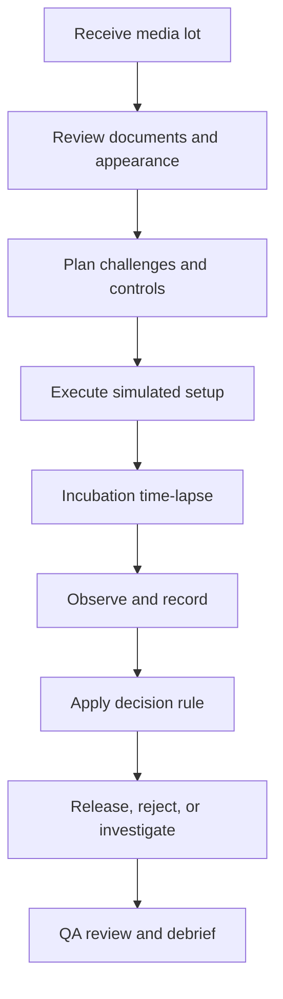

# Growth Promotion Simulation Lab

## Detailed Game Design & Web-App Implementation Specification

**Working title:** `CultureCheck: Growth Promotion Lab`  
**Document status:** Implementation-ready concept specification v1.0  
**Primary platform:** Desktop-first responsive web app  
**Recommended renderer:** Three.js with lightweight HTML/CSS overlays  
**Primary language:** English UI; optional Thai learning notes and glossary  
**Reference context:** USP general chapters `<61>` and `<62>`  

---

## 1. Executive concept

`CultureCheck` is a procedural laboratory simulation in which the player acts as a newly assigned pharmaceutical microbiology analyst. The player must qualify culture-media lots before those lots may be released for routine testing under the laboratory's controlled procedure.

The game is not a plate-counting toy and must not collapse the exercise into “choose the organism and click incubate.” Its central learning problem is **evidence integrity**:

1. Is the media lot traceable and visually acceptable?
2. Was the correct performance property challenged: promotion, inhibition, or indication?
3. Were suitable controls included?
4. Is the result interpretable?
5. Does the evidence support release, rejection, or investigation?
6. Is the player accidentally confusing growth-promotion testing, method suitability, and product testing?

The visual presentation is a quiet, realistic training laboratory rather than a game arcade or a neon “AI dashboard.” Three.js provides environmental presence, object interaction, incubation time-lapse, turbidity, colony emergence, condensation, and controlled camera movement. HTML/CSS provides the data-entry and review surfaces so the application remains readable and usable.

> Product principle: **2D productivity + 3D laboratory presence.**

---

## 2. Scientific and compliance boundary

### 2.1 What the simulation teaches

- The purpose of media performance qualification before use.
- The conceptual distinction among:
  - **Growth promotion:** can the medium support the intended low-level challenge?
  - **Inhibitory property:** does a selective medium suppress the designated non-target challenge as expected?
  - **Indicative property:** does a differential medium produce the expected characteristic reaction?
- Positive-control, negative-control, reference-lot, and environmental-control logic.
- Traceability of medium lot, organism lot/passage, preparation date, analyst action, and result.
- Data integrity: contemporaneous recording, corrections, audit trail, and second-person review.
- The difference between:
  - Media GPT/performance testing.
  - Suitability of a test method in the presence of a product.
  - Routine examination of a product sample.
- Why a plate or tube result can be **invalid**, **inconclusive**, or **requires investigation**, rather than simply pass/fail.

### 2.2 What the simulation must not claim

- It must not claim to replace the current official USP–NF text, a site SOP, pharmacopeial subscription, validated laboratory method, or qualified trainer.
- It must not present a simplified in-game parameter as universally compliant.
- It must not award “certification” or authorize a learner to perform unsupervised wet-lab work.
- It must not imply that colony appearance alone provides definitive microbial identification.
- It must not expose operational culture handling as a free-form sandbox. All organisms, media, observations, and outcomes are predefined educational states.

### 2.3 Versioned compliance profile

Do not hard-code compendial parameters throughout the UI. Implement a versioned `complianceProfile` loaded from JSON. The laboratory administrator or content maintainer can map the current licensed chapter and approved SOP into the profile without rewriting game logic.

```ts
export interface ComplianceProfile {
  id: string;
  displayName: string;
  effectiveDate: string;
  references: Array<{ title: string; url?: string; internalDocId?: string }>;
  disclaimer: string;
  mediaDefinitions: MediaDefinition[];
  challengeDefinitions: ChallengeDefinition[];
  decisionRules: DecisionRule[];
}
```

Ship an **educational demonstration profile**, clearly labeled as non-operational. Exact strains, challenge levels, incubation windows, recovery rules, and selective/indicative expectations must be checked against the current licensed USP text and the adopting laboratory's SOP before a production training release.

---

## 3. Target audience and learning outcomes

### 3.1 Audience

- New pharmaceutical microbiology analysts.
- QC staff rotating into microbiology.
- University learners in pharmaceutical microbiology.
- QA reviewers who need to understand media-release evidence.
- Trainers conducting pre-laboratory briefing.

### 3.2 Learning outcomes

After completing the core campaign, the learner should be able to:

1. Explain why growth promotion is a property of the medium lot and why method suitability is a different question.
2. Select a defensible set of challenges and controls from an approved scenario.
3. Recognize promotion, inhibition, and indication as separate claims.
4. Interpret quantitative solid-media recovery and qualitative broth growth without inventing precision.
5. recognize invalid tests caused by contamination, missing controls, mixed culture, out-of-window reading, transcription error, or unsuitable reference evidence.
6. Choose among `Release`, `Reject`, `Quarantine / Investigate`, and `Test Invalid – Repeat Under Procedure`.
7. Produce a complete evidence packet that another reviewer can reconstruct.

---

## 4. Design pillars

### Pillar A — Decisions before animations

Every visual effect must correspond to a laboratory state or evidence item. Colony emergence is useful; decorative floating molecules are not.

### Pillar B — The player may be wrong for the right-looking reason

A visually healthy plate may still be invalid because the negative control grew, the reference plate was missing, or the read occurred outside the controlled window.

### Pillar C — “Stop and investigate” is a skilled action

The scoring system must reward the player for refusing to release an uninterpretable lot.

### Pillar D — Observation is not conclusion

The player first records what is seen, then applies an interpretation. The game stores both separately.

### Pillar E — Calm, credible, replayable

Use an elegant laboratory ambience, concise interactions, fast resets, deterministic scenario seeds, and a reviewable event log.

---

## 5. Core gameplay loop



Typical mission duration: **10–18 minutes**.  
Expert challenge duration: **20–30 minutes**.  
No waiting in real time: incubation is represented by controlled time-lapse, but the player must choose the correct read point defined by the active scenario profile.

---

## 6. Campaign structure

### Mission 0 — Orientation: What question are you testing?

The player is shown three work orders:

- Qualify a newly received medium lot.
- Demonstrate recovery of an organism from a preservative-containing product.
- Examine a routine product sample.

The player must route each to `Media Performance`, `Method Suitability`, or `Routine Product Test`. Incorrect routing triggers a short visual explanation before any bench work begins.

### Mission 1 — The clean baseline

- Nonselective medium with a valid low-level challenge.
- Complete positive and negative controls.
- Clear expected outcome.
- Teaches work-order review, labels, observation, and release decision.

### Mission 2 — Reference comparison

- Solid medium lot under evaluation versus a qualified reference/control condition.
- Player counts or confirms assisted colony counts, reviews both observations, and interprets recovery using the scenario's decision rule.
- One plate contains edge colonies and a merged cluster, teaching count confidence rather than false exactness.

### Mission 3 — Selective and differential media

- Separate challenges for growth promotion, inhibition, and characteristic response.
- Player must not treat one target-organism plate as proof of every performance property.

### Mission 4 — The contaminated negative control

- Test plates appear acceptable.
- Negative control develops growth.
- Correct action: invalidate or investigate according to the configured procedure; do not release the lot.

### Mission 5 — Product interference trap

- The request is actually method suitability, not GPT.
- If the player continues through the media-release workflow, the game allows it but flags a scope error during QA review.
- Correct action: reroute and document why.

### Mission 6 — Weak liquid-medium response

- Broth shows borderline visual change.
- The player compares against a valid positive control and records `clear`, `equivocal`, or `no visible growth` rather than entering a fictional CFU count.

### Mission 7 — Documentation discrepancy

- Physical lot label and certificate metadata do not agree.
- Biological performance may pass, but the lot remains quarantined because traceability is compromised.

### Mission 8 — Capstone investigation

Randomized combination of:

- Incorrect challenge mapping.
- Out-of-window read.
- Negative-control growth.
- Reference-lot anomaly.
- Selective property failure.
- Indicative response failure.
- Duplicate plate ID.
- Audit-trail correction.

The player submits a complete media-release packet for an AI-free deterministic QA engine to review.

---

## 7. Laboratory environment and Three.js scene

### 7.1 Visual direction

**Quiet Pharmaceutical Microbiology Lab**

- Warm neutral wall finish.
- Stainless bench with subtle roughness.
- Frosted glass partition.
- Soft daylight plus task lighting.
- Sage-green nominal indicator.
- Muted amber hold/investigation state.
- Deep red reserved for critical/invalid state.
- Charcoal typography.
- No purple-blue gradient, holograms, glowing cards, cyberpunk panels, or oversized glassmorphism.

### 7.2 Scene zones

| Zone | 3D objects | Interaction | HTML surface |
|---|---|---|---|
| Receiving desk | Media boxes, CoA folder, barcode scanner | Inspect lot and documents | Lot intake drawer |
| Preparation bench | Tube rack, plates, labels, pipette silhouette | Arrange predefined challenge setup | Test-plan builder |
| Incubator | Door, shelf trays, status light | Load, choose controlled cycle, inspect timeline | Incubation schedule |
| Observation station | Lighted plate viewer, tube lamp | Rotate plate, adjust light, zoom | Observation form |
| Review desk | Monitor, release stamp, deviation folder | Open evidence packet | QA decision panel |
| Waste/hold zone | Red hold bin, quarantine rack | Move invalid setup or held lot | Disposition reason |

### 7.3 Camera rules

- Fixed cinematic anchors, not free-flight navigation.
- Smooth 0.6–1.0 second transitions using damped interpolation.
- Maximum parallax approximately 1–2 degrees.
- No WASD, no first-person movement, no physics-based object throwing.
- `Esc` always returns to the room overview.
- Camera focus must never hide the active form or make labels unreadable.

### 7.4 Three.js effects with instructional value

- **Broth turbidity:** shader or alpha-volume interpolation driven by growth state.
- **Pellet/sediment:** optional predefined visual state; never interpreted automatically as one organism.
- **Colonies:** GPU-instanced meshes or sprites with deterministic position seeds.
- **Characteristic reaction:** controlled agar color field and colony material changes.
- **Condensation:** subtle normal/roughness overlay that can create an observation difficulty scenario.
- **Incubator timeline:** lighting and clock transition; not a real-world accelerated biological model.
- **Contaminant event:** one or two colony morphotypes on a control, visibly distinguishable but not sensationalized.

### 7.5 Performance targets

- Initial compressed asset payload target: under 8 MB.
- Desktop: stable 60 FPS on mid-range integrated graphics.
- Reduced-quality mode: 30 FPS floor.
- Pixel ratio cap: 1.5 desktop, 1.25 low-power device.
- Use baked lighting and compressed GLB (`Draco` or `Meshopt`) where practical.
- Pause rendering or reduce to 5 FPS when the tab is not visible.
- Respect `prefers-reduced-motion` and offer `2D Lab Mode`.

---

## 8. Interaction model

### 8.1 Object state

Every interactable object implements:

```ts
interface LabObjectState {
  id: string;
  enabled: boolean;
  status: 'idle' | 'available' | 'active' | 'complete' | 'hold' | 'invalid';
  hotspotLabel: string;
  ariaLabel: string;
  evidenceIds: string[];
}
```

### 8.2 Interaction sequence

1. Hover/focus: subtle outline and plain-language action label.
2. Click/Enter: camera moves to fixed anchor.
3. HTML task panel opens beside the scene.
4. Player performs the decision or records an observation.
5. Scene state changes only after the action commits.
6. The event is written to the audit trail.

### 8.3 Accessibility

- Full keyboard control for every hotspot and form.
- Visible focus ring.
- Non-color status icon and text.
- Optional narrated observation descriptions.
- Plate colors selected for common color-vision deficiencies.
- A `Describe this plate` button provides objective morphology text without giving the conclusion.

---

## 9. Media and challenge content model

The first release should support a small but extensible set of educational media classes:

| Class | Example in game | Primary visual evidence | Performance dimensions |
|---|---|---|---|
| General-purpose solid medium | Soybean–casein digest agar / TSA naming per local profile | Colony count and morphology | Promotion |
| Fungal solid medium | Sabouraud dextrose agar | Yeast or mold colony emergence | Promotion; indication only if configured |
| General-purpose liquid medium | TSB / soybean–casein digest medium | Turbidity compared with control | Promotion |
| Selective/differential solid medium | MSA, MacConkey, XLD | Growth/no growth plus characteristic color | Promotion, inhibition, indication |
| Selective enrichment broth | Rappaport–Vassiliadis | Enrichment evidence followed by selective plating | Promotion/selectivity under profile; no direct definitive ID |

The game must explicitly label common naming variants and prevent the learner from assuming that all items are “identification agars.”

### 9.1 Challenge definition

```ts
interface ChallengeDefinition {
  id: string;
  displayName: string;
  organismCategory: 'bacterium' | 'yeast' | 'mold';
  referenceStrainLabel: string;
  allowedMediaIds: string[];
  purpose: Array<'promotion' | 'inhibition' | 'indication'>;
  educationalExpectedState: string;
  exactOperationalParameters?: 'REQUIRES_LOCAL_PROFILE';
}
```

### 9.2 Required controls in the engine

- Uninoculated medium control.
- Positive growth control when defined by the scenario.
- Qualified comparison/reference medium or standardized inoculum evidence when required by the profile.
- Environmental/setup control only in scenarios where the local procedure defines it.
- Audit check that controls belong to the same session and correct media lot.

---

## 10. Simulation state machine

```ts
type MissionPhase =
  | 'briefing'
  | 'intake'
  | 'planning'
  | 'setup'
  | 'incubation'
  | 'observation'
  | 'interpretation'
  | 'disposition'
  | 'qa_review'
  | 'debrief';

type TestValidity =
  | 'not_assessed'
  | 'valid'
  | 'invalid_control_failure'
  | 'invalid_traceability'
  | 'invalid_timing'
  | 'invalid_mixed_culture'
  | 'requires_investigation';

type LotDisposition =
  | 'release'
  | 'reject'
  | 'quarantine_investigate'
  | 'test_invalid_repeat'
  | 'not_decided';
```

No direct transition from `observation` to `release` is allowed. The player must assess validity and interpretation first.

---

## 11. Deterministic scientific engine

### 11.1 Separation of layers

```text
Scenario truth
  -> simulated observations
  -> learner observations
  -> deterministic interpretation checks
  -> disposition
  -> feedback
```

- `Scenario truth` is never visible to the player during play.
- `Simulated observations` are what the Three.js scene renders.
- `Learner observations` are stored exactly as entered.
- The engine scores evidence and rule application; it does not ask a language model to judge scientific correctness.

### 11.2 Example rule structure

```json
{
  "id": "negative-control-integrity",
  "when": { "controlType": "uninoculated", "observedGrowth": true },
  "effect": {
    "validity": "invalid_control_failure",
    "allowedDispositions": ["quarantine_investigate", "test_invalid_repeat"],
    "blockRelease": true
  },
  "feedbackCode": "CTRL-NEG-GROWTH"
}
```

### 11.3 Quantitative and qualitative observations

**Solid media** may use:

- Raw colony count.
- Count range when crowding prevents exact count.
- Confidence: high / moderate / low.
- Recovery comparison computed by the engine according to the active profile.

**Liquid media** must use:

- Clear growth.
- No visible growth.
- Equivocal / requires further action.
- Comparison with the positive and uninoculated controls.

Do not display a fake liquid-broth CFU result.

---

## 12. Scenario generation

### 12.1 Deterministic seed

Each mission is created from a shareable seed:

```ts
interface ScenarioSeed {
  campaignId: string;
  missionId: string;
  variant: number;
  randomSeed: string;
  complianceProfileId: string;
}
```

The same seed must reproduce colony positions, counts, document defects, control failures, and correct disposition.

### 12.2 Defect library

| Defect | What the learner sees | Correct reasoning target |
|---|---|---|
| Weak promotion | Reduced recovery or faint broth response | Compare with defined evidence; do not eyeball pass |
| Failed inhibition | Non-target organism grows unexpectedly | Selective property not demonstrated |
| Failed indication | Growth occurs but reaction is atypical | Promotion may pass while indication fails |
| Contaminated negative control | Unexpected colony/turbidity | Session validity compromised |
| Reference anomaly | Both test and reference underperform | Cannot blame test lot without resolving reference evidence |
| Label mismatch | Lot/expiry disagreement | Quarantine on traceability grounds |
| Timing deviation | Reading outside active profile window | Result may be invalid or require investigation |
| Mixed culture | Two morphotypes in nominal pure challenge | Challenge integrity failure |
| Data correction | Player changes a committed count | Reason for change and audit entry required |

---

## 13. Scoring model

Total: 100 points.

| Domain | Weight | Examples |
|---|---:|---|
| Scientific plan | 20 | Correct property, challenge, and controls |
| Procedural integrity | 20 | Labels, timing, traceability, sequence |
| Observation accuracy | 20 | Count, morphology, broth comparison, confidence |
| Interpretation | 20 | Validity assessment and application of profile rules |
| Disposition and documentation | 15 | Defensible decision, concise rationale, audit completeness |
| Efficiency | 5 | Avoids unnecessary repeats and irrelevant tests |

### Critical-error ceiling

Any of the following caps the mission grade until remediated:

- Releasing a lot after negative-control growth.
- Fabricating or overwriting a result without an audit reason.
- Treating method suitability as media GPT.
- Claiming organism identity from insufficient evidence.
- Ignoring a traceability mismatch.

### Grade bands

- `90–100`: Release-ready reasoning.
- `80–89`: Competent; minor coaching required.
- `70–79`: Conditional pass; targeted remediation.
- `<70`: Repeat mission.
- Any unresolved critical error: `Not competent for this scenario` regardless of numeric score.

---

## 14. Feedback and debrief

The debrief must be evidence-based, not a generic success screen.

### Debrief layout

1. **Your disposition** versus **supported disposition**.
2. Timeline of the player's decisions.
3. Evidence that supported or contradicted the decision.
4. Missed control or validity issue.
5. One-sentence scientific principle.
6. “Try another variant” with the same learning objective.

### Feedback style

Good:

> You observed acceptable target growth, but the uninoculated control also showed growth. Because session integrity was not demonstrated, release was blocked. The defensible action was to hold the lot and follow the investigation/repeat procedure.

Bad:

> Wrong! The plate failed.

---

## 15. User interface specification

### 15.1 Persistent header

- Mission title.
- Current phase.
- Controlled virtual time.
- Media lot ID.
- Save/resume state.
- Accessibility and graphics controls.

### 15.2 Evidence rail

A collapsible right-side rail shows only collected evidence:

- Documents.
- Controls.
- Recorded observations.
- Deviations.
- Open questions.

Unknown evidence is not shown as an empty checklist that reveals the answer.

### 15.3 Lab notebook

Every committed entry includes:

- Virtual timestamp.
- Player identity/profile.
- Object or sample ID.
- Original value.
- Amended value, if any.
- Reason for change.
- System-generated or learner-entered source.

### 15.4 Decision panel

The player must complete:

- Is the session valid?
- Which media properties were demonstrated?
- Which were not demonstrated?
- Disposition.
- Evidence-linked rationale, limited to 600 characters.

The rationale uses evidence chips, e.g. `[NEG-CTRL-01]`, rather than untraceable free prose.

---

## 16. Audio and atmosphere

- Low HVAC bed.
- Incubator latch and subtle fan.
- Soft glass/plate handling sounds.
- No music during evidence review by default.
- Optional minimal score only in briefing/debrief.
- Audio never conveys a critical state without equivalent visual and text cues.

---

## 17. Technical architecture

### 17.1 Recommended stack

- Vite + TypeScript.
- Three.js directly, or React Three Fiber only if the team already uses React.
- Zustand or a small deterministic state store.
- Zod for scenario/config validation.
- IndexedDB for local progress and evidence packets.
- Vitest for rules and state-machine tests.
- Playwright for mission-flow tests.
- Optional service worker for offline classroom use.

### 17.2 Layering

```text
src/
  app/              routing, shell, accessibility
  scene/            Three.js room, objects, animations
  simulation/       deterministic observations and timelines
  rules/            validity and disposition engine
  content/          missions and compliance profiles
  notebook/         evidence and audit trail
  ui/               forms, panels, debrief
  persistence/      IndexedDB and export/import
  tests/             unit, scenario, end-to-end
```

The scientific rules must not be embedded in shader code, GLTF names, or UI components.

### 17.3 Core data types

```ts
interface MediaLot {
  id: string;
  mediumId: string;
  supplierLot: string;
  receivedAt: string;
  expiryOrRetestDate: string;
  appearanceState: 'acceptable' | 'suspect' | 'unacceptable';
  documentIds: string[];
}

interface Observation {
  id: string;
  targetId: string;
  observedAtVirtualTime: string;
  type: 'colony_count' | 'morphology' | 'turbidity' | 'color_reaction' | 'document';
  value: unknown;
  confidence: 'high' | 'moderate' | 'low';
  source: 'learner' | 'system';
}

interface EvidencePacket {
  missionSeed: ScenarioSeed;
  observations: Observation[];
  auditEvents: AuditEvent[];
  validity: TestValidity;
  disposition: LotDisposition;
  rationale: string;
  score?: ScoreBreakdown;
}
```

---

## 18. Save, export, and instructor mode

### Learner mode

- Autosave after every committed action.
- Resume incomplete mission.
- Export a human-readable PDF/JSON evidence packet.
- Reset only after explicit confirmation.

### Instructor mode

- Select mission, variant, and difficulty.
- Show/hide Thai glossary.
- Choose educational compliance profile.
- Review class error patterns without exposing personal data.
- Import a locally approved profile JSON.
- Lock exact parameters so learners cannot edit them.

Instructor mode must not silently turn the game into an operational laboratory record system.

---

## 19. Difficulty system

### Guided

- Hotspots sequenced.
- Control checklist visible.
- Objective observation hints.
- Immediate feedback before final disposition.

### Standard

- Free choice among relevant stations.
- No answer-revealing checklist.
- Feedback after submission.

### Expert

- Distractor documents.
- Subtle control or timing defects.
- Limited number of unnecessary repeats before efficiency penalty.
- QA reviewer may return a targeted query.

Difficulty must change information support, not alter the scientific truth.

---

## 20. Quality assurance and test strategy

### 20.1 Rule-engine unit tests

- Negative-control growth always blocks release.
- Missing mandatory control prevents a valid pass.
- Promotion, inhibition, and indication resolve independently.
- A passed promotion result cannot overwrite a failed indicative result.
- Method-suitability work order cannot be closed as media GPT.
- Same scenario seed yields the same truth and render states.
- Out-of-profile reading produces the configured validity action.

### 20.2 Scenario validation

Build a validator that rejects content when:

- No defensible disposition exists.
- Two decision rules conflict without precedence.
- Required evidence is impossible to collect.
- The visual state contradicts the truth state.
- An “identification” conclusion exceeds the configured evidence.
- Operational parameters are missing from a profile labeled production.

### 20.3 Visual tests

- Plate count remains legible at supported resolutions.
- Agar and colony colors remain distinguishable under simulated color-vision modes.
- Condensation never makes the only critical clue invisible.
- Text overlays do not overlap the scene or browser safe area.
- 2D fallback conveys the same evidence.

### 20.4 Acceptance criteria for v1

- Missions 0–5 playable from start to debrief.
- At least 12 deterministic variants.
- All critical-error ceilings implemented.
- Evidence packet export works offline.
- Keyboard-only campaign completion is possible.
- No console errors during a complete playthrough.
- Median first load under 3 seconds on a typical office connection after cache warm-up.
- No LLM required for scientific evaluation.

---

## 21. Content safety and legal notes

- Use fictional lot numbers and fictional products.
- Do not include patient or production data.
- Do not ship proprietary SOP text.
- Use organism and media descriptions only to the detail required for the controlled educational scenarios.
- Attribute USP chapter titles and link to official pages; do not copy the full paid chapter into the repository.
- Display on the title screen and exports:

> Training simulation only. The current official compendium, approved laboratory procedure, and qualified supervision remain authoritative.

---

## 22. Source grounding for content maintainers

Use these sources to confirm chapter scope and maintain links. The implementation team must recheck effective versions before release.

1. USP `<61>` official DOI landing page:  
   https://doi.usp.org/USPNF/USPNF_M98800_02_01.html
2. USP harmonization/adoption notice for `<61>` (official date 1 May 2025):  
   https://test.usp.org/harmonization-standards/pdg/general-methods/microbial-enumeration
3. USP `<62>` official DOI landing page:  
   https://doi.usp.org/USPNF/USPNF_M98802_01_01.html
4. USP microbiological quality-control overview:  
   https://www.usp.org/microbiology/
5. USP `<1227>` overview on validating recovery and method suitability:  
   https://doi.usp.org/USPNF/USPNF_M99947_03_01.html
6. FDA BAM Media Index for public descriptions of common media:  
   https://www.fda.gov/food/laboratory-methods-food/media-index-bam

---

## 23. Recommended production phases

### P0 — Content and rule prototype

- Implement JSON schemas.
- Implement deterministic rule engine.
- Create Missions 0–2 in a plain 2D interface.
- Unit-test validity and disposition logic.

### P1 — Vertical slice

- Build one lab room.
- Add receiving, incubator, and observation stations.
- Implement one solid plate and one broth visual state.
- Complete Mission 1 end-to-end with evidence export.

### P2 — Core game

- Missions 0–5.
- Selective/differential performance states.
- Audit-trail corrections.
- Accessibility and 2D fallback.

### P3 — Capstone and instructor tools

- Missions 6–8.
- Variant authoring/validation.
- Instructor dashboard.
- Localization.

### Explicitly out of scope for v1

- Multiplayer.
- Real laboratory instrument integration.
- Real production batch disposition.
- Free-form biological simulation.
- Generative AI grading.
- VR/AR.
- A full LIMS.

---

## 24. Handoff prompt for Codex Sol High

```text
Build the web app described in GROWTH_PROMOTION_SIMULATION_LAB_GAME_DESIGN.md.

Treat the document as the authoritative product and implementation specification. Start with P0 and P1 only: a deterministic, offline-capable vertical slice containing Mission 0 plus one complete media-lot qualification mission. Use TypeScript, Vite, Three.js, Zod, Vitest, and Playwright. Keep scientific rules, scenario content, Three.js rendering, and UI components in separate layers.

The application must be an educational simulation, not an operational USP implementation. Load all configurable scientific parameters from a versioned educational compliance-profile JSON. Never invent missing exact compendial parameters; mark them as requiring licensed USP/current SOP verification. Scientific scoring must be deterministic and must not call an LLM.

Design direction: quiet pharmaceutical microbiology laboratory, warm neutral light, stainless bench, restrained sage/amber status colors, fixed camera anchors, subtle interaction, and no cyberpunk/space-tech/AI-dashboard styling. Follow “2D productivity + 3D laboratory presence.” No WASD or free-flight camera.

Before coding, create IMPLEMENTATION_PLAN.md, SCIENTIFIC_ASSUMPTIONS.md, and a scenario schema. Then implement the vertical slice, tests, accessibility, 2D fallback, evidence/audit trail, and JSON export. Run all tests and perform a complete Playwright playthrough. Do not claim any unimplemented item as complete. Update README with setup, architecture, training disclaimer, source grounding, and exact implemented scope.
```

---

## 25. Final design decision

The strongest version of this concept is not “watch microorganisms grow in 3D.” It is a **decision-integrity simulator** in which attractive laboratory visuals make the evidence tangible, while the core challenge is knowing whether the evidence is valid and what it actually supports. That framing makes the game useful for pharmaceutical microbiology training and keeps it credible beyond its initial visual novelty.
